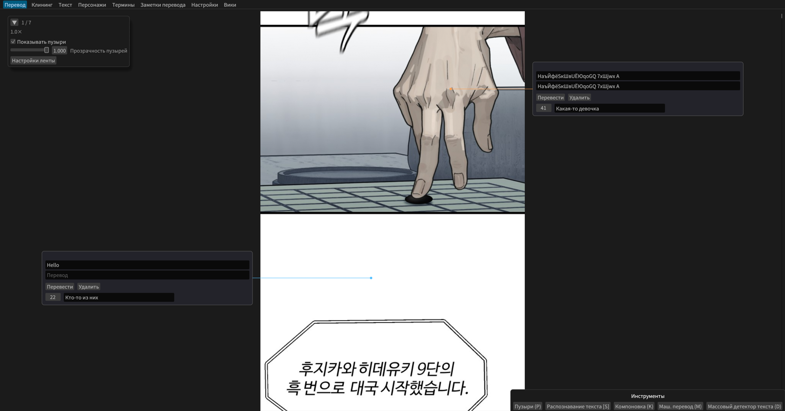
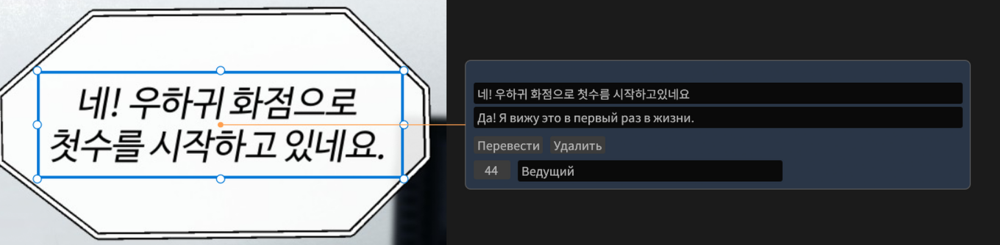
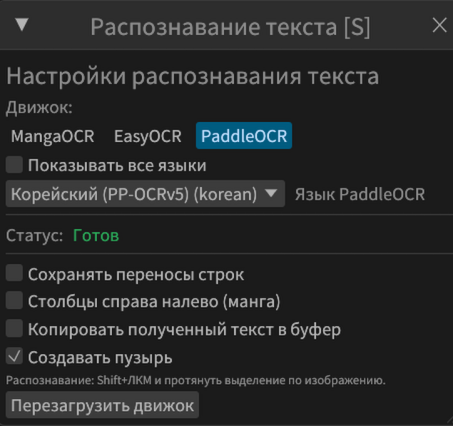
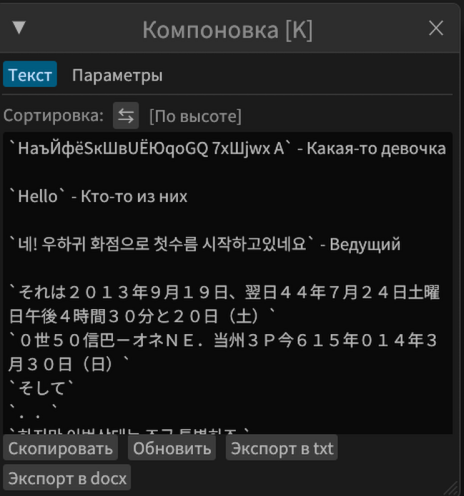
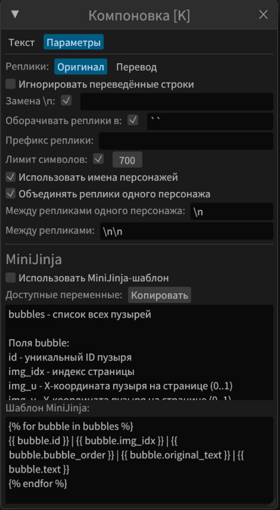
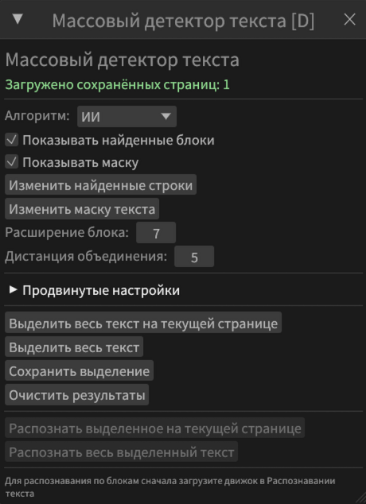
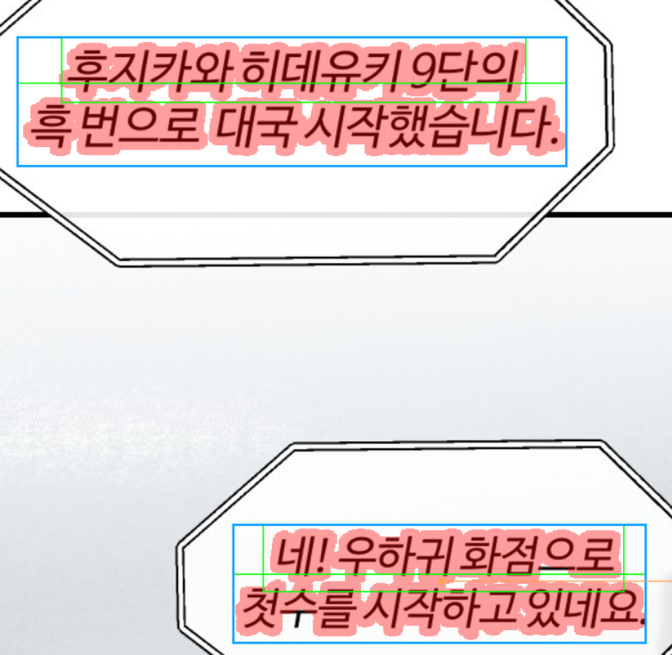
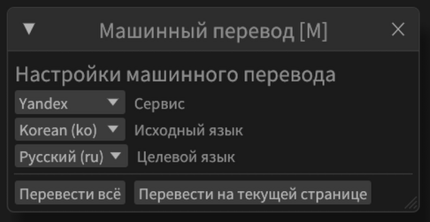
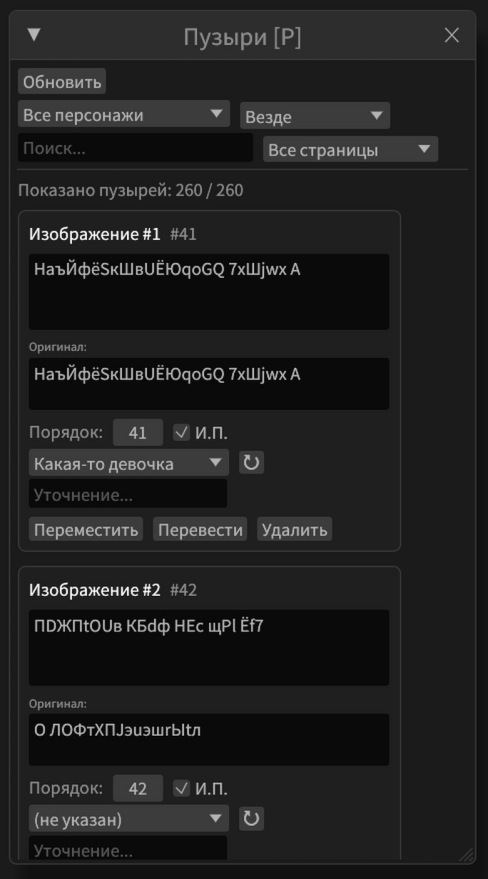

# **Translation** tab

**Note:** the screenshots are captured with the Russian interface. Retaking them in English is a task waiting for a volunteer — pull requests are welcome.

### **Translation instructions are at the end**

Here you can create text bubbles, recognize text and paste the translation.

## **Text bubble**

Needed for the initial translation. Later it lets you quickly insert the text while typesetting.

- Created manually with the T key; it extends to the left or to the right from the point on the ribbon where the cursor was at creation time
- Can be created by OCR, in which case it contains the recognized text.
- Can be deleted with the Del key
- Can be copied and pasted with Ctrl+C and Ctrl+V, and duplicated with Ctrl+D
- Can be dragged
- **Top line** - the original text
- **Bottom line** - the translation. Unlike the other elements, which are present only in the translation tab, this line appears in every tab.
- The number, `42` in this case, is the line number for cases when the order of the lines is not top to bottom. For manga, for example. It will be used in the translation composition.
- The field after the number, `Ведущий` ("Host") in this case, is the name of the character who speaks, or another description of the line, for example `thoughts of the main character` or `caption`. The field has autocompletion, suggesting the names of the characters created in the corresponding tab, or other presets.
- It has these buttons:
  - `Translate`: Translates the top line and pastes the result into the bottom line. It uses the service selected in the machine translation panel.
  - `Delete:` Deletes the text bubble

## **Image bubble**

### **Mainly needed for AI translation via API**
- Created with `Q` or by selecting with `Shift+Q`
- Can contain a fragment of the page inside the red selection, or an external image
- `Description` is filled in manually and explains to the AI what this is
- `Original` and `Translation` are filled in by the AI
- They can hold several text areas inside the red frame at once.
  - Outside the translation tab these become separate bubbles

## **Quick insertion of a character name**

The 6 most recently used names are shown at the top of the ribbon.
To insert one of them quickly, hold the needed digit from 2 to 6 together with the hotkey for creating a bubble or for selecting. For example `4 + T` or `Shift + 2 + LMB` 

## **Text recognition**

- `Shift+LMB` selects the area on the title's ribbon where the text will be recognized

### EasyOCR
A simpler and more universal engine, supports many languages.

### PaddleOCR
An advanced OCR from Chinese engineers, good for Chinese, Japanese, English and Korean. But it may fail to start for some users.

### MangaOCR
Japanese-only OCR, specially trained on manga. It often already accounts for right-to-left reading of columns.

### Surya
The largest text recognition engine, does not require a language choice. It can be more accurate in places, but it is the slowest of them all.

### AI API
Ask ChatGPT or DeepSeek to recognize difficult text. The most expensive and the most accurate method.

### PaddleOCR-VL
Something in between Surya and PaddleOCR

### Settings
- `Keep line breaks` - self-explanatory
- `Copy the recognized text to the clipboard` - whether the recognized text should be copied to the clipboard
- `Right-to-left columns` - useful when working with manga, where Japanese text is often laid out in columns read right to left. If enabled, the order of the recognized lines is mirrored.
- `Create a bubble` - whether to create a bubble with the recognized text in the center of the selected area
- `Replace characters` - configure manually what is replaced with what. By default it replaces mid-line dots with regular ones, and the ellipsis with three separate dots

## **Translation composition**

Makes it easier to assemble the lines for the AI.

**Composition panel settings**

- `Sort`:
  - `By height` - the lower a text bubble is on the ribbon, the later it is inserted. The line number does not matter. Usually for the vertical comic format.
  - `By line number` - ignores the height and looks at the line number.
- `Copy` - copies the composition to the clipboard
- `Refresh` - refreshes the composition, but this is usually not needed, since it happens when the panel is opened.
- `Replace \n` - what to replace a line break inside bubbles with. Usually it is a space, but someone may need to separate the lines explicitly, for example if OCR gives the wrong order.
- `Wrap lines in` - self-explanatory, I think
- `Line prefix` - what to insert before each line
- `Character limit` - up to how many characters the composition is built. The lines of the last character are inserted in full, even if the limit is exceeded.
- `Use character names` - if disabled, it simply collects the lines, only wrapping them in backticks.
- `Merge lines of the same character` - if enabled, insert the next parameter between the lines of the same character
- `Between lines of the same character` - one new line by default
- `Between lines` - what to insert between lines when the characters are different. Two new lines by default.

### **MiniJinja**

Lets you build any composition of the lines you want. Give the AI the available parameters from the first text field, ask it to write the template you need, and paste it into the second field.

## **Bulk text detector**
 

Almost like the one in BallonsTranslator. It finds text blocks and outlines them in blue, lines in green, and the cleaning mask in red.
It has these parameters:

- `Algorithm`: The classic one triggers falsely more often and does not generate a mask. The AI one may run longer for some users, but it often finds text better and generates a mask that can later be used for quick cleaning.
- `Show detected blocks` - hide or show the green outlines of the lines and the blue blocks
- `Show mask` - hide or show the red text mask
- `Block expansion` - by how much to expand each green line in every direction. 5-10 is recommended
- `Merge distance` - at what distance lines are merged into blocks. 5 is recommended
- `Recognize` - use the loaded recognition engine to recognize the text in the areas outlined in blue.

## **Machine translation**

### **It is strongly NOT recommended for a public translation.**
- You can use it to read something quickly for yourself
- For a public translation, better use AIs like ChatGPT, Gemini, DeepSeek and others, together with the composition panel.

## **AI API**

- Automatically sends the title context and the lines to the selected AI
- Lets you translate images only
- The quality is already acceptable for a public translation
  - Still, the quality is better if you send the composed lines to Gemini manually and paste them back, that way it is easier to edit in parallel

So far it supports only Google and Yandex; Deepl does not work yet.

## **Bubbles panel**

Lets you quickly search and edit the translation

## **How to translate**
- You paste the AI instructions from the `Translation notes` tab
- You recognize the original text. Whatever is not recognized, for example very distorted fonts, is better left for later, or given to the AI as a screenshot right away.
- You mark who speaks where
- You paste the composed lines into the AI
- You paste the text translated by the AI into the text bubble in the right place via `RMB` -> `Paste into translation`
- This is how you translate the main text
- Then, separately, you take screenshots of the distorted text/sound effects and translate them with the AI, creating new bubbles with T

In general, you can translate however you like, with your own knowledge of the language or with an ordinary translator, but if you do not know the language, better use an AI.
