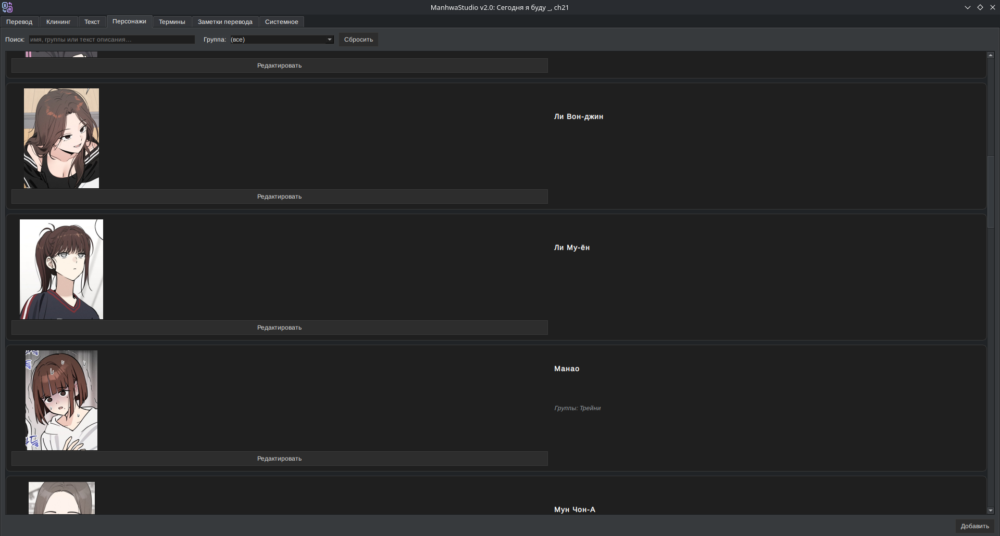
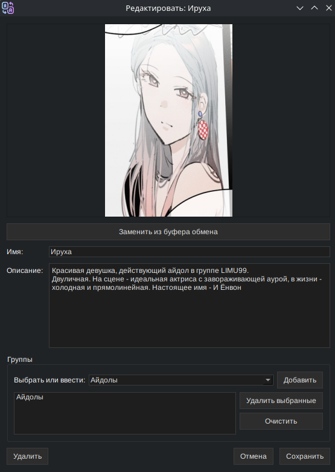

# **Characters tab**

**Note:** the screenshots are captured with the Russian interface. Retaking them in English is a task waiting for a volunteer — pull requests are welcome.

The list of the title's characters with images, a name, a description and groups.
- The character data (except the images) is converted into the prompt for the translation.
- Search works over all the fields at once
- A specific group can be shown

## **The edit/new character window**

- An image can be pasted from the clipboard
- A name and a description can be set
- A character can be added to existing groups, or a new group can be created
