# The **New project** window

**Note:** the screenshots are captured with the Russian interface. Retaking them in English is a task waiting for a volunteer — pull requests are welcome.

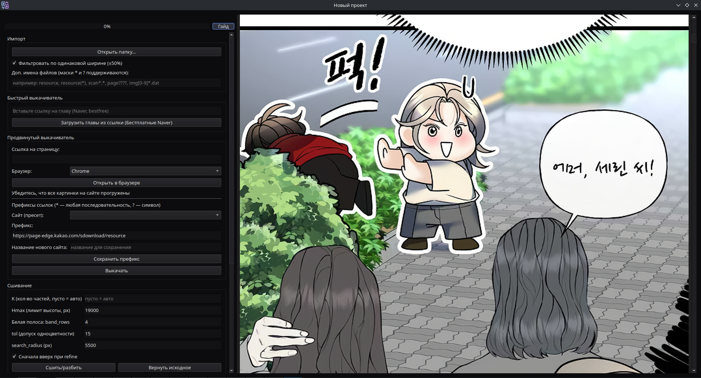

Downloads a chapter from various sites and pre-processes it.

## Batch processing
Bulk downloading and processing of chapters based on a node graph. Still unfinished and unpolished. Works partially. Pay it no attention.

## **Import**
The `Open folder` button lets you open a folder with manhwa images and import them.

- You can open a folder with an already downloaded chapter, in which case the images must be named in the correct order, for example `1.png/jpg/jpeg`
- You can open a site with a chapter saved in your main browser. 
  - In that case the program inspects the `html` file one level above with the same name as the folder, and loads the images in the same order they appeared on the page.
  - If the HTML file is not found, the program tries to load the images or `resource(X)` files as images in the order of their names.
  - You can set a file name pattern if the image files are named unusually
- The ±50% width filter works well with vertical-format comics, helping to remove ad images, but **it is better to disable it for manga and other paged comics**, otherwise pages may disappear

The `Open file` button lets you open a single image, an archive, or the html file of a downloaded site.

The `Paste from clipboard` button lets you paste one copied image.

`Append mode` - switch it on so as not to wipe the whole ribbon when adding a forgotten image.

## **Quick downloader**
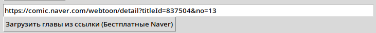

- The input field at the top and the download button let you quickly download a free chapter from comic.naver.com, **!not from series.naver.com!**
- Hover over the download button to see the supported sites.

## **Advanced downloader**

Opens the specified page in a full-fledged browser and downloads the images by the chosen method.

### **Deep interception**
The simplest and most universal mode, which works even with complicated sites. But it **only works with CloakBrowser**, and it downloads everything on the page that looks like an image. **After it finishes, a window opens and you have to manually deselect the images that do not belong to the chapter, for example the ads.**

## **Download Canvas from the page**
Its functionality is already built into deep interception, you may leave it alone. It downloads the images in the case when they are `<canvas>` elements and not ``.

## **Pattern link search**
A cleaner but more painful method, which does not work everywhere. **BASIC SKILLS OF DIGGING IN THE PAGE CODE ARE REQUIRED**, the guide is at the bottom of this wiki.

It searches for links by a prefix pattern:
- `*` means any combination of characters
- `?` means any single character
- It is a prefix, so its beginning matters. The unstable ending may be omitted.

Prefixes can be saved and loaded.

### Collecting links
Helps if not all the images appeared on the page at once. For example, the site loads them along the way, or it is a page-by-page reader.

**In that case start the collection, scroll through the whole chapter, and stop the collection.**

### Download threads
Multi-threaded downloading is many times faster, but it does not always work. If the images have to be fetched using the browser session instead of an ordinary request, the download is unfortunately single-threaded.

## **Stitching / Slicing**
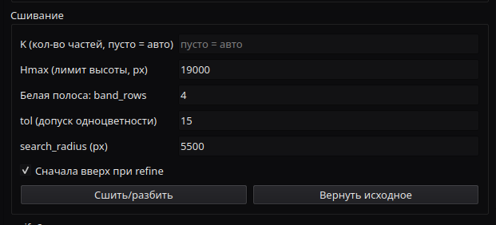

Stitches all the images into a single ribbon and then splits them so as not to cut through text and artwork. **!Do not use for manga!**, only for manhwa/manhua and other comics that come as a long ribbon.

### **Stitching parameters**
- `Number of parts`: How many parts to split the ribbon into. If empty, it is automatic.
- `Hmax`: Into parts of what height (in pixels) to cut the ribbon during automatic splitting.
- `White band`: A line of how many pixels to check for a single color when marking the cut spots. Put simply - how thin a stripe of one color may be for a cut to be allowed there.
- `Single-color tolerance`: How much the color of the pixels may differ at a spot where cutting is allowed. It is worth raising it if this is a shoujo with lots of pretty artwork.
- `search radius`: How far in both directions from the planned cut spot a suitable place will be searched for.

### **Modes of operation**
- `Stitch ribbon` - just stitches everything into one long ribbon and nothing more
- `Stitch and place cut lines` - stitches and marks the cut spots for manual control. More on them below.
- `Stitch and slice automatically` - stitches and immediately slices at the optimal spots. Fast, but manual control is better.
- `Stitch only at uneven spots` - does not cut, it only glues the ribbon where the cuts went through artwork or texture

### **Manual stitching and slicing**
After `Stitch and place cut lines`, or after adding a cut line manually, this interface appears:

  - **The red arrow** marks the cut line on the scrollbar
  - **The blue arrow** marks an **already existing cut**
  - **The red line** is the future cut itself, it can be moved and deleted
  - **The red `Slice` button** at the top applies all the cut points and rebuilds the ribbon

- A cut line can be added from the RMB menu
- Also, from the RMB menu the current page can be stitched with the next and the previous one

### **Other page actions**

This is the action menu in the corner of every page.
- The up and down arrows swap the current page with the next or the previous one
- The cross deletes it
- The page can be cropped manually

## **Slice as a chapter**
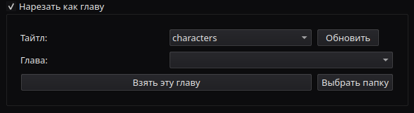

Takes the selected chapter as the reference and cuts the images exactly the same way. Needed to download alternative versions for the Stamp tool.

If there is a difference in the total height of the two chapters, a window opens:

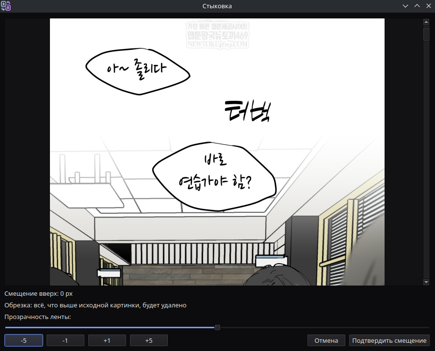
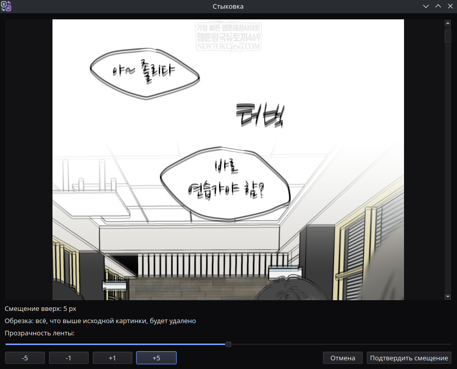

Here you need to make sure the images match. The image of the downloaded chapter will be semi-transparent. You need to adjust the height so that it looks like the first picture and not like the second one.

### **After that you need to save it as an alternative version for the selected chapter, giving it a name.**

## **Image processing (Waifu2x/Reline)**
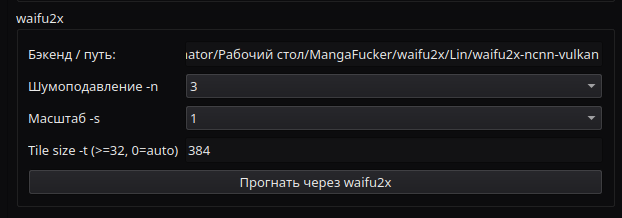

## Waifu2x

An outdated but still working AI for denoising and upscaling. Simpler and faster than Reline

## Reline

A modern AI for denoising and upscaling. It has many different models, mostly for manga. 

## **Saving**
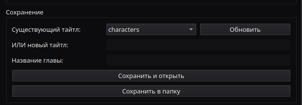

Saves the processed title into the project structure or simply into a chosen folder (independent saving).

If you are just saving the first chapter, choose "Save as project base", enter the name, and press "Save and open".

- The title is both a text field and a drop-down list. You can enter your own.

# Hacking a site and building a prefix
Using mto.to as an example

## 1. Open the chapter in an ordinary browser and press F12
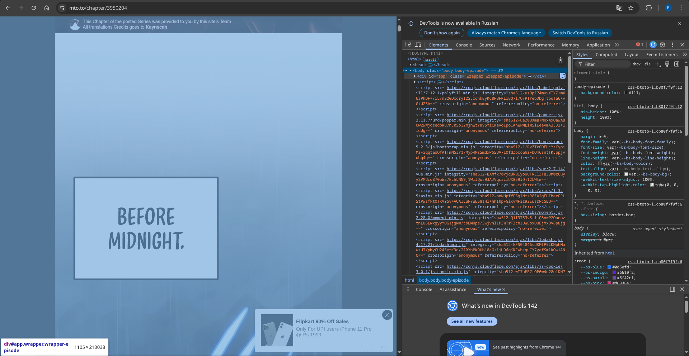

## 2. Hover over the different HTML tags and the browser itself shows what they are responsible for. If the part of the site with the chapter image is highlighted - unfold the tag until you reach the image itself.
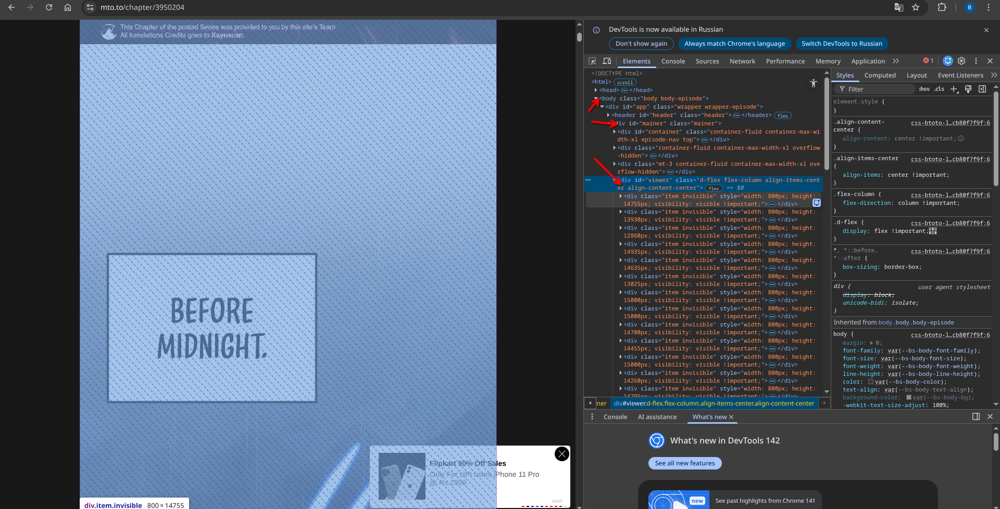

## 3. Open the tag with the specific image and look at the link there.
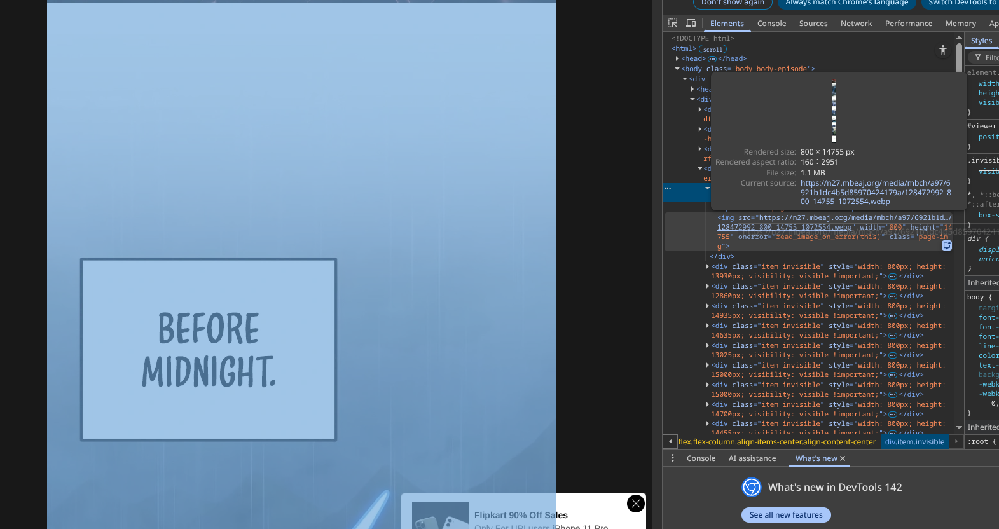
### For example, here we have the link `https://n27.mbeaj.org/media/mbch/a97/6921b1dc4b5d85970424179a/128472992_800_14755_1072554.webp` Open it in a new tab and make sure it is an image.

### Next, open a few more tags with images and collect the links. For example, here:
- `https://n27.mbeaj.org/media/mbch/a97/6921b1dc4b5d85970424179a/128472992_800_14755_1072554.webp`
- `https://n25.mbuul.org/media/mbch/a97/6921b1dc4b5d85970424179a/128472994_800_12860_1448870.webp`
- `https://n21.mbrtz.org/media/mbch/a97/6921b1dc4b5d85970424179a/128473001_800_15000_1578696.webp`
- `https://n06.mbwww.org/media/mbch/a97/6921b1dc4b5d85970424179a/128473003_800_15000_1167770.webp`

## 4. Look at the links carefully and find what they have in common. For example, here:
- For example, the subdomain always starts with n
- The site names always contain mb
- The first section is always /media
- The rest, for example `mbch/a97/6921b1dc4b5d85970424179a`, may change from title to title

## 5. Recall how my simplified pattern works
- `*` means any combination of characters
- `?` means any single character

## 6. Build the prefix pattern
- Take the beginning of the link, in this case `https://n06.mbwww.org/media/`
- Replace everything that changes with wildcards, for example instead of `n06` there will be `n*` or `n??`
- Add * at the end
- You get something like this: `https://n*.mb*.org/media/*`

## 7. Congratulations! `https://n*.mb*.org/media/*` can be pasted as the prefix into the advanced downloader
