# **Aba Limpeza**

**Observação:** as capturas de tela foram feitas com a interface em russo. Refazê-las em português é uma tarefa à espera de alguém voluntário — pull requests são bem-vindos.

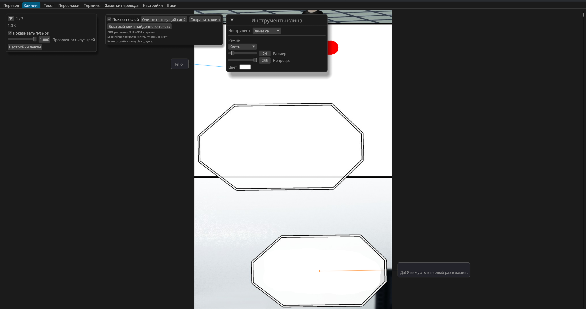

Serve para remover o texto original das páginas do quadrinho.
Por enquanto tem 2 ferramentas - `Pintar` e `Remoção com IA`

## **A limpeza sumiu?**
A partir da 2.7, a estrutura foi alterada. Agora a limpeza é guardada na pasta **projects/{série}/{capítulo}/clean_layers** e não em **cleaned**. Basta copiar as imagens para a nova pasta.

## **Painel superior**
- `Esvaziar a camada` - apaga tudo o que foi desenhado
- `Mostrar a camada` - alterna a visibilidade da sobreposição de desenho. Permite ver o que foi desenhado agora e o que já existe na imagem original.
- `Limpeza rápida` - Caso tenha havido detecção de texto; descrição completa abaixo.
- `Salvar limpeza` - salva as imagens na pasta de limpeza do projeto

## **Ferramenta Pintar**
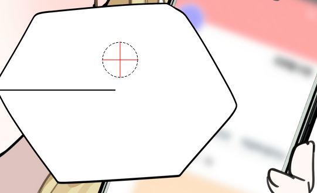

Pincel rápido com conta-gotas, borracha e retângulo. Serve para cobrir texto sobre fundo uniforme.

- O cursor mostra o tamanho da área de desenho e a cor atual (neste caso, `vermelho`)
- `Clique esq.` - desenho normal
- `Clique dir.` - conta-gotas, captura a cor sob o centro do cursor
- `Shift+clique esq.` - borracha
- `Shift+roda do mouse` - tamanho do pincel
- `Ctrl+clique esq.` - Seleção e preenchimento de uma área retangular, para uma limpeza ainda mais rápida

## **Ferramenta Remoção com IA**
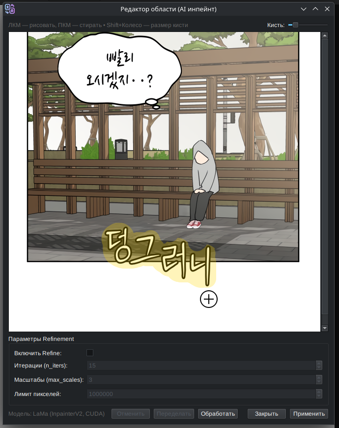
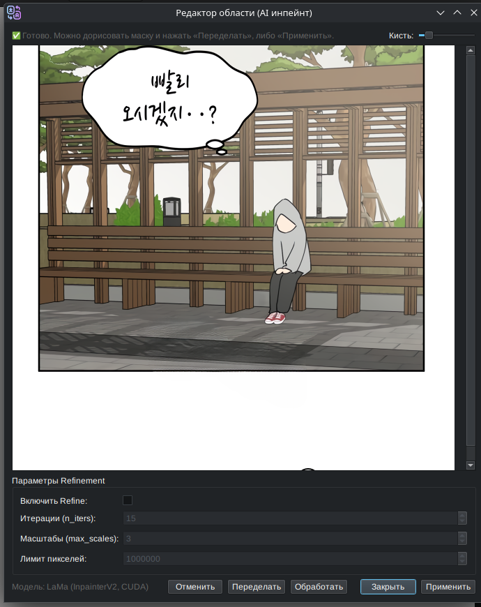

Seleciona uma área da tira e remove os objetos sob a máscara. Usa a IA do repositório `advimman/lama`

- Com `Shift+clique esq.`, selecione uma área da tira
  - **Se a janela não abrir, é porque a seleção pegou mais de uma página**
- Abrirá uma nova janela para desenhar a máscara
  - Desenhar a máscara com o `clique esq.`
  - Apagar a máscara com o `clique dir.`
  - Mudar o tamanho do pincel com `Shift+roda do mouse`
- O botão `Processar` executa a IA e remove o objeto sob a máscara
- É possível ativar o `Refine`, que às vezes dá um resultado um pouco melhor
- Se algo sair errado, você pode clicar em `Reverter` e redesenhar a máscara
- É possível selecionar novamente com a máscara e remover os artefatos
- O botão `Fechar` simplesmente fecha esta janela
- O botão `Aplicar` sobrepõe a área alterada na tira

### Outros modelos de IA

- `Lama MPE` - modelo Lama menor e um pouco mais burro, do repositório zyddnys/manga-image-translator. Mas às vezes ele funciona melhor com estilo anime e quadrinhos do que o Lama comum
- `AOT` - Modelo bem pequeno, treinado em mangá. Também do zyddnys/manga-image-translator

## **Ferramenta Degradê**
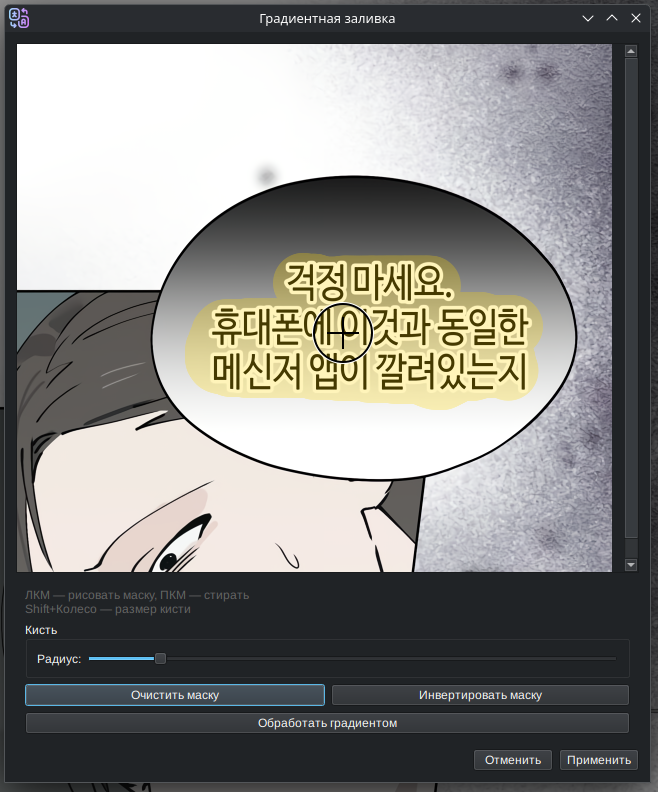
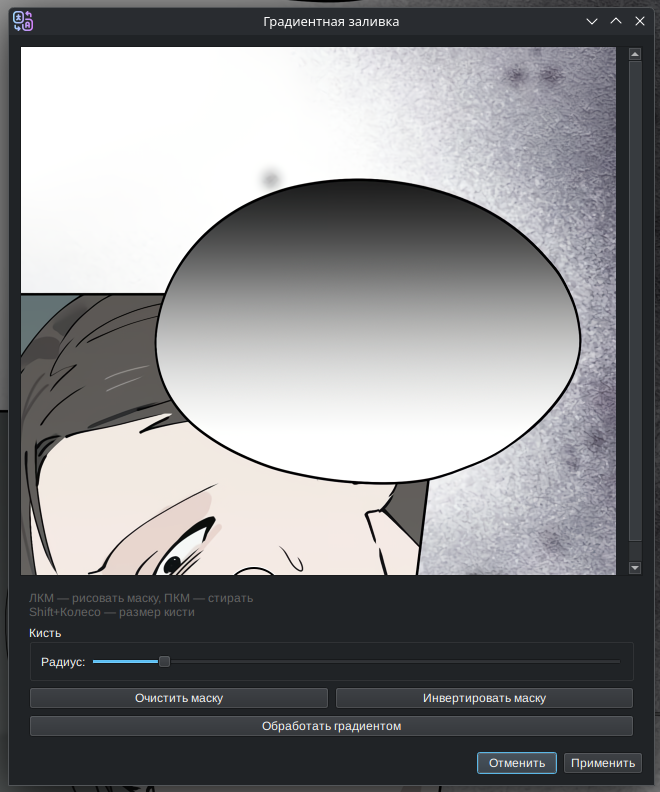

Seleciona uma área da tira e tenta reconstruir o degradê sob a máscara. Frequentemente preenche o degradê melhor que a IA

- O controle é análogo ao da ferramenta `Remoção com IA`
- Não quebra se um pedaço de cor estável cair sob a máscara
- O programa pode travar por um instante, isso é normal

## **Ferramenta Carimbo**
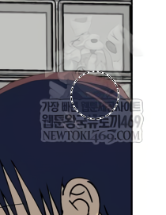
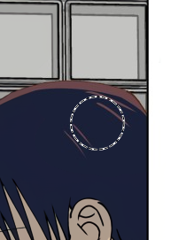

Pega a área sob si a partir do mesmo lugar de outra imagem e desenha com ela. 

Permite pegar algo de outra versão do mesmo capítulo, por exemplo as onomatopeias em inglês. Ou remover marcas d'água usando uma versão traduzida para outro idioma qualquer que não as tenha.

### **Para usar esta ferramenta, é preciso baixar e salvar no baixador uma versão alternativa deste capítulo.**

Tem os seguintes parâmetros:

- Original: Pasta com as imagens. Pode haver várias. Na pasta do projeto isso fica na pasta alt_vers.
- Tamanho: Tamanho do pincel. Também é ajustado com **Shift+roda do mouse**.
- Pré-visualização: Ajusta a opacidade da pré-visualização dentro do círculo do pincel.
- Deslocamento Y: Move a imagem de onde a área é extraída para cima e para baixo. Útil se ali houver banners inseridos.

Controles:

- Clique esq.: Desenhar
- Clique dir.: Borracha
- Shift+clique esq.: Borracha (seleção retangular)
- Ctrl+clique esq.: Preencher (seleção retangular)

## **Limpeza rápida**
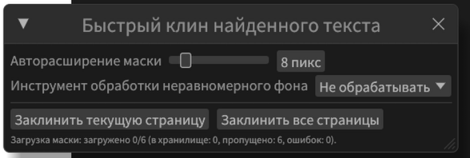
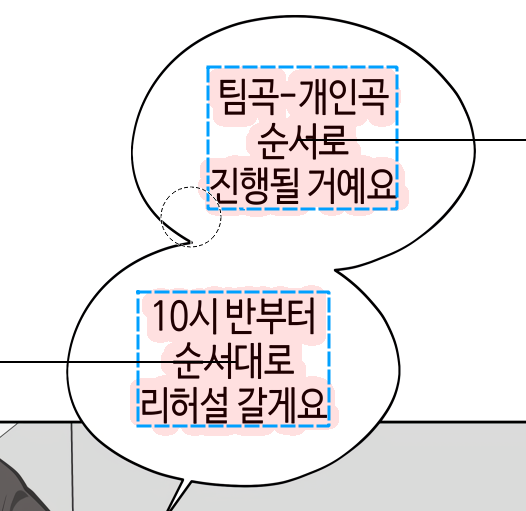

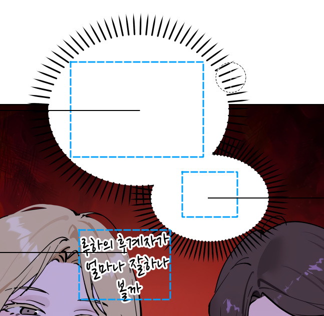

### **Primeiro faça a detecção de texto na aba Tradução**

Usa a máscara de texto obtida após a detecção na aba de tradução para tentar cobrir o texto sobre fundo uniforme.
Só pinta se a cor nas bordas da máscara for igual.

- `Expansão automática da máscara` - Quanto expandir a máscara se a cor não for uniforme. Ajuda a limpar um pouco mais de texto. Dispara 1 vez.

## **Como fazer a limpeza no Photoshop?**
### Limpeza completa
- Pegue as imagens em **projects/{série}/{capítulo}/scr**
- Processe no Photoshop
- Salve na pasta **projects/{série}/{capítulo}/clean_layers** e reinicie o programa

### Processar uma área difícil
- Selecione a área com uma das ferramentas de edição de área (OpenCV/Degradê/IA)
- Sem alterar nada, clique em **Aplicar**; essa área será transferida para a camada transparente de limpeza
- Clique em **Salvar camadas**
- Abra no Photoshop a imagem correspondente na pasta **projects/{série}/{capítulo}/clean_layers**
- Processe, salve e reinicie o programa
