# **Aba Texto**

**Observação:** as capturas de tela foram feitas com a interface em russo. Refazê-las em português é uma tarefa à espera de alguém voluntário — pull requests são bem-vindos.

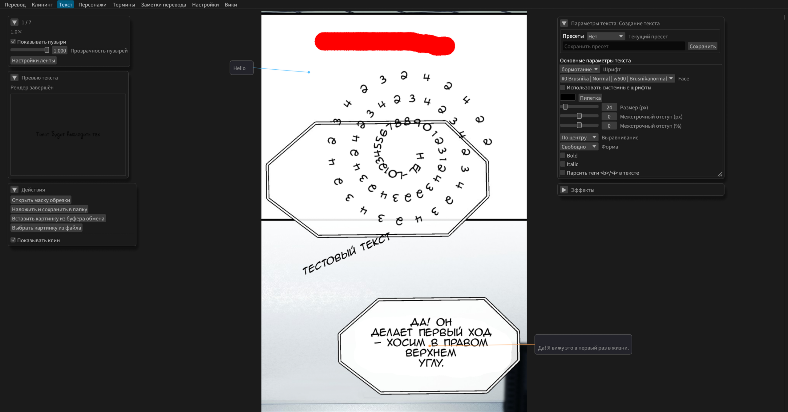
Permite posicionar imagens de texto sobre a tira

## **Princípio de funcionamento**
- Você seleciona a área do texto com `Shift+clique esq.`
- Abre-se a janela de edição, na qual é inserido o texto do balão que caiu dentro da área selecionada
- Depois que o foco é perdido (um clique fora), a janela de edição se fecha e é criada a imagem de texto com os parâmetros desejados
- A imagem pode ser movida por arrasto 
- A imagem pode ser escalada com as teclas `-` e `=`
- A imagem pode ser rotacionada apontando o cursor e usando `Ctrl+roda do mouse`
- É possível ajustar o tamanho da fonte com `Shift+roda do mouse`

## **Painel de parâmetros**
### **Pré-visualização do texto**
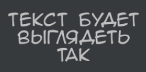

Mostra como o texto ficará com os parâmetros atuais, sem levar em conta o tamanho da fonte. Atualiza automaticamente.

### **Parâmetros principais do texto**
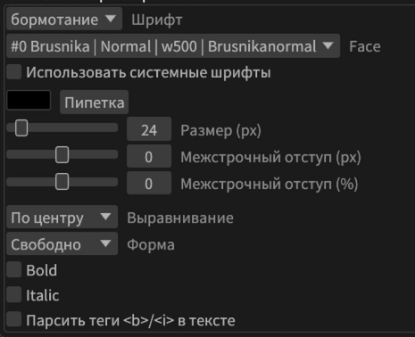

- `Predefinição`: Salve e carregue os parâmetros definidos para cada fonte.
- `Fonte`: O programa vem com várias fontes, mostradas na lista suspensa. É possível adicionar as suas, colocando um arquivo ttf/otf na pasta fonts
- `face`: escolha da fonte dentro da família, se houver mais de uma
- `Usar fontes do sistema`: Por padrão, as fontes são carregadas apenas da pasta fonts ao lado da instalação do programa
- `Grupo de fontes`: Limite as fontes exibidas àquelas que estão em `fonts/groups/<nome do grupo>`. As fontes podem ser duplicadas.
- `Tamanho`: Tamanho da fonte
- `Entrelinha`: Espaçamento entre as linhas do texto, em pixels. Pode ser negativo.
- `Kerning`: `Métrico` - distância sempre igual entre as letras. `Auto` - usar os pares de caracteres da fonte, por exemplo `AV`, para que alguns caracteres fiquem mais próximos. Não funciona com todas as fontes.
- `Kerning X`: Distância adicional entre os caracteres
- `Altura/Largura do caractere`
- `Alinhamento`: À esquerda, à direita, centralizado ou livre. É possível mover o controle deslizante para uma posição intermediária.
- `Rotação global`: Gira todo o texto enquanto ele ainda está em estado vetorial (não rasterizado). Dá uma imagem visivelmente mais nítida que a rotação comum.
- `Forma`: Princípio de composição das linhas, mais detalhes abaixo.
- `Quebra`: Hifenização automática do texto para respeitar a forma. Ajusta sua intensidade ou a desativa.
- `Suavização`: Análoga à suavização do Photoshop. Afeta a nitidez do texto.
- `Permitir espinha de peixe moderada`: Afeta a forma do texto. Permite depressões na forma.
- `Bold`: **Fonte em negrito**, não funciona com todas as fontes
- `Italic`: Fonte inclinada, não funciona com todas
- `Pontuação suspensa`: Os sinais de pontuação automaticamente não são afetados pelo alinhamento do texto. A lista de caracteres pode ser encontrada nas configurações, mas ali estão quase todos.
- `Remover espaços sobrantes`: Remove os espaços nas bordas das linhas.
- `Nova linha após o fim da frase`
- `Tudo em maiúsculas`
- `Analisar as tags`: Permite marcar uma parte específica do texto com `<b>` ou `<i>`, para deixar só uma parte do texto assim. Exemplo: `Em negrito ficará apenas <b>uma</b> palavra`. Hoje isso é automatizado: basta selecionar o texto, alterar os parâmetros disponíveis, e ele será envolvido nas tags.

### **Parâmetros avançados do texto**
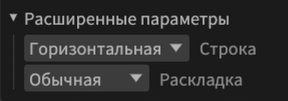

- `Linha`: Pode ser horizontal (como de costume) e vertical.
  - Para a vertical, está disponível tanto da direita para a esquerda quanto da esquerda para a direita.
- `Disposição da linha`: Padrão e fórmula. A fórmula permite fazer qualquer forma.

### **Parâmetros adicionais do texto**
Nem sempre disponíveis.

#### **Parâmetros apenas para o texto selecionado**
- `Deslocamento X/Y`: Deslocamento do caractere ou do grupo
- `Deslocamento pela linha`: Se o texto usa uma disposição personalizada ou por fórmula, desloca os caracteres selecionados ao longo dela
  - `Deslocar os caracteres seguintes`: Apenas para o deslocamento pela linha. O texto seguinte se moverá junto com o trecho selecionado.
- `Rotação do caractere`: No texto selecionado, gira cada caractere separadamente
- `Rotação do grupo`: Gira todo o texto selecionado em conjunto
- `Não dividir`: O texto não será dividido na hifenização automática.

## **Painel de edição de texto**
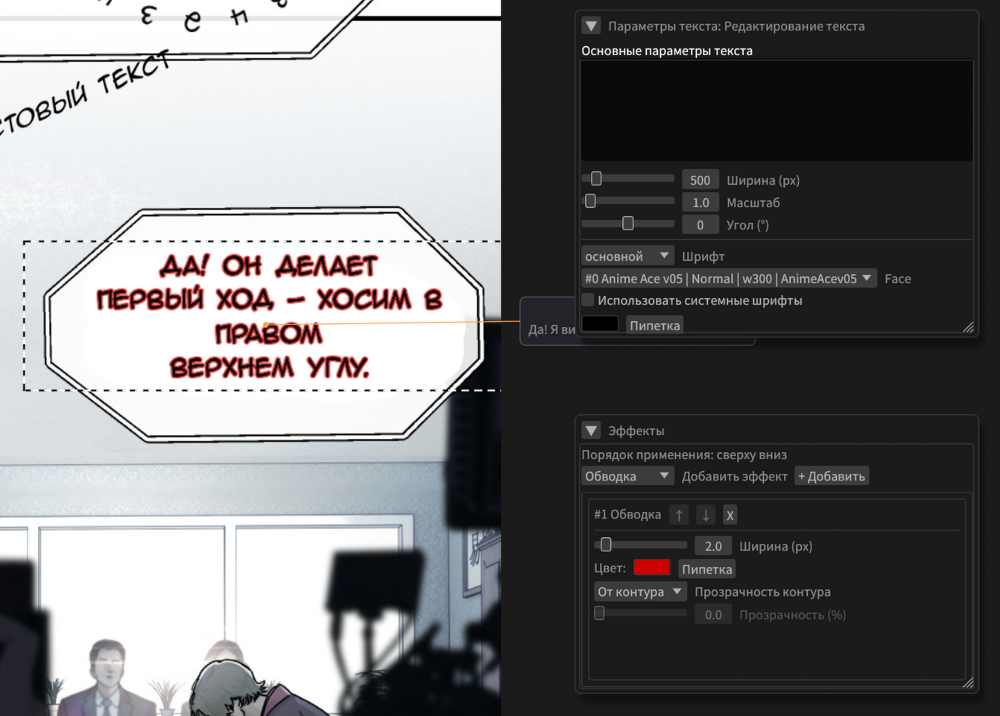

Aparece ao selecionar uma imagem de texto. Parecido com o painel de criação de texto, mas tem um campo de texto. As alterações são aplicadas imediatamente.

**É possível selecionar parte do texto, alterar os parâmetros disponíveis, e isso criará automaticamente tags inline.**

## **Forma do texto**
Embora seja mais correto chamá-la de forma rápida.

O texto tenta se encaixar nessa forma, evitando espinhas de peixe e usando uma hifenização inteligente.

O texto pode ter as seguintes formas:
- `Livre`: Posicionado normalmente.
- `[ ]`: Quadrada
- `( )`: Oval
- `< >`: Hexagonal
- As 2 últimas formas têm o parâmetro de largura mínima. Quanto maior ele for, mais largos ficam o topo e a base do texto.

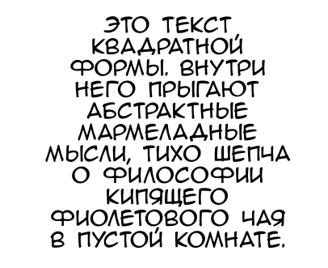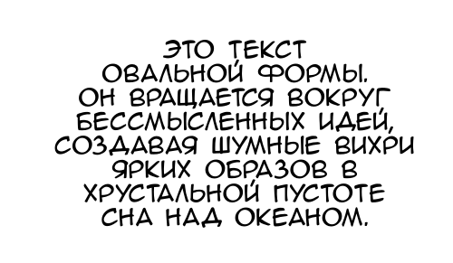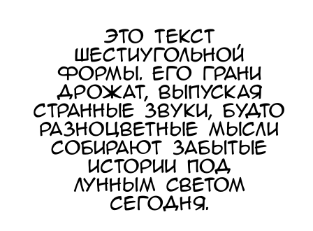

Como se vê, as formas não diferem muito. Mas é melhor usar a oval.
Às vezes a força da hifenização não é suficiente para encaixar o texto na forma. Nesse caso, brinque com os parâmetros de largura, tamanho da fonte, largura mínima e força da hifenização. Ou escolha uma forma rápida clicando com o clique dir. na camada de texto.

## **Forma de texto avançada**

Pode ser encontrada no painel de edição.
Mostra de algumas até centenas de milhares de formas possíveis, sem espinhas de peixe e com hifenização correta, que podem ser filtradas.
Diferentemente da forma rápida, esta forma é estável e não muda até você mesmo mudá-la ou escolher outra. É preservada ao alterar a fonte e outros parâmetros.

### Texto original e texto formado
Quando a forma avançada é aplicada, o programa passa a usar para criar a camada de texto não mais o texto original, mas o texto formado. É possível alternar entre eles. O texto formado pode ser editado por você e receber tags. Mas, ao escolher a forma novamente, o programa voltará a usar o texto original para o cálculo dela, e ao escolher outra forma o texto formado será sobrescrito.

## **Efeitos de texto**

### **Contorno**
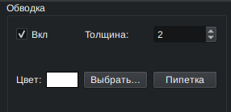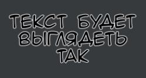

Contorna o texto com uma linha da cor e da espessura desejadas

### **Brilho**
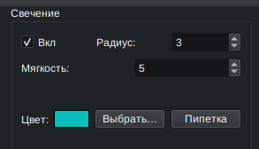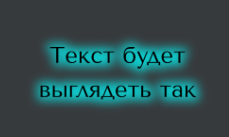

Cria uma aura ao redor do texto

### **Sombra**
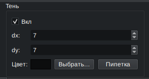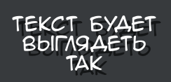

Adiciona ao texto uma sombra com o deslocamento indicado em X e Y

### **Degradê: 2 cores**
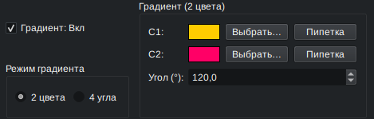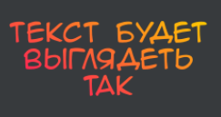

Deixa o texto em degradê na direção desejada

### **Degradê: 4 cantos**
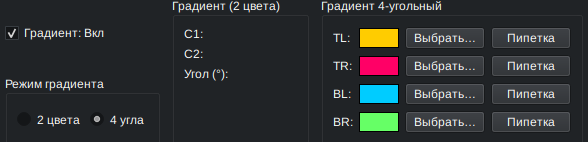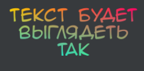

Adiciona ao texto um degradê baseado em quatro cantos

### **Ações**
- `Atualizar a imagem original` - recarrega a página atual na tela. É necessário se você esqueceu de limpar alguma coisa.
- `Mostrar os balões de texto` - possibilidade de ocultar os balões de texto nas laterais, para avaliar melhor a tradução final

### **Salvamento**
Salva a série traduzida de duas maneiras. Recomenda-se o render de cena.

## **Máscara de recorte**
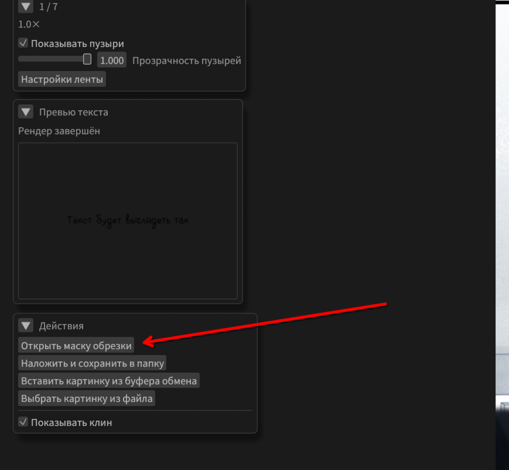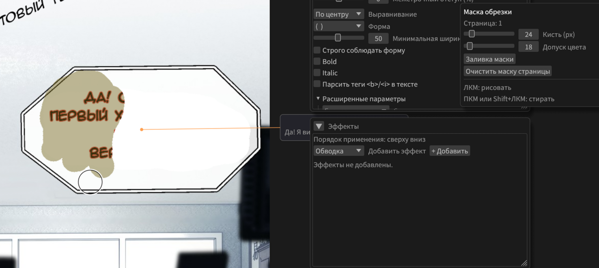
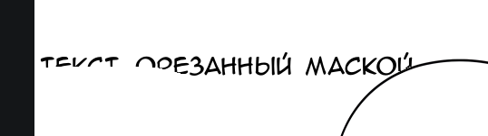
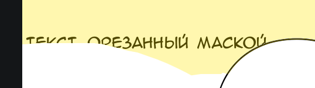

Permite recortar as imagens de texto. Se a imagem de texto encostar na máscara, ela será recortada e só ficarão visíveis as partes que estiverem sob a máscara. Para cada texto é possível desativar o recorte no menu do clique dir.
Tem cor amarela transparente e não fica visível quando este painel está fechado.

### **Pincel da máscara**

- Está ativado por padrão enquanto o painel estiver aberto
- Com o `clique esq.` desenha; com o `clique dir.` ou `Shift+clique esq.` apaga. O tamanho é ajustado com `Ctrl+roda`.

### **Preenchimento da máscara**

- É ativado ao clicar no botão correspondente no painel da máscara
- Ao clicar com o clique esq., começa a preencher a partir do ponto do clique, espalhando-se pela cor semelhante, considerando a tolerância

## **Transformação do texto (perspectiva)**

É possível entrar no modo de transformação clicando com o clique dir. no texto selecionado e escolhendo o item correspondente no menu.
Permite deformar o texto não apenas para dar perspectiva, arrastando-o pelas alças.

## **Disposição personalizada do texto**

Coisa útil para onomatopeias.
**Para começar, escolha no menu do clique dir. do texto o item "Entrar no modo de edição de disposição"**

**Este modo não permite perder o foco no texto; é preciso clicar em "Sair" de propósito**

- Mude o tamanho do texto arrastando a área pelos cantos
- Escolhendo uma linha no painel, dê um clique esq. na área para adicionar o início dela
- Com Shift+clique esq., arraste o ponto quadrado, deixando pontos intermediários, para definir a forma da linha
- Com o clique esq., basta arrastar os pontos, mudando a forma sem criar novos
  - O ponto redondo grande é o início da linha
  - O redondo pequeno é intermediário
  - O ponto quadrado é o fim; por ele a linha pode ser estendida
  - Se os pontos e a linha estiverem cinzas, é porque outra linha está selecionada no momento
    - Se todos os pontos e linhas estiverem cinzas, é porque a linha selecionada ainda não foi criada; dê um clique esq. para criar o primeiro ponto.

### **Mecânica**
- Cada linha desta disposição corresponde a um fragmento de texto entre quebras de linha. De uma vez é possível criar várias onomatopeias parecidas

### **Painel**

- Adição e remoção de linhas
- Suavização (deixa a linha menos angulosa)
- Direção e inversão do texto
- Distância mínima ao caractere: Simplesmente ao longo da linha, ou impedindo a sobreposição dos caracteres

## **Adicionar suas próprias fontes**
Na pasta do programa há uma pasta `fonts`, onde ficam 4 fontes principais - Anime Ace, uma para legendas, uma para onomatopeias e a Arial. Ali você pode colocar seus arquivos `.ttf`/`.otf`.

## **Disposição do texto por fórmula**
Não sei para quê, mas existe.
A disposição por fórmula fica em `Parâmetros avançados`:
- `Disposição`: `Padrão` ou `Fórmula`
- as linhas de fórmulas `x`, `y`, `rotation`
- o botão `?` depois das fórmulas (mostrar/ocultar a colinha de variáveis e funções)
- os parâmetros da trajetória (`t_start/t_end`, `offset`, `scale`, `normal_offset`, `letter_spacing`)
- as constantes `a..h`

### **Como isso funciona**
O programa calcula a posição e o ângulo de **cada caractere separadamente**.

Para cada caractere é tomado o parâmetro `t` (normalmente de `0` a `1`), e então:
- `x = formula_x(...)`
- `y = formula_y(...)`
- `rotation = formula_rotation(...)` (em radianos)

Depois disso são aplicados os deslocamentos/escalas e, se ativada, a rotação tangente à trajetória.

### **Parâmetros do modo de fórmula**
| Parâmetro | O que faz | Como usar |
|---|---|---|
| `Disposição` | Alterna o modo | `Padrão` para a disposição normal, `Fórmula` para arcos/espirais/trajetórias arbitrárias |
| `x` | Fórmula da coordenada X de cada caractere | Ponto de partida básico: `t * w` |
| `y` | Fórmula da coordenada Y | Ponto de partida básico: `120 * sin((t - 0.5) * pi)` |
| `rotation` | Rotação adicional de cada caractere | `0` para nenhuma rotação extra, `0.2*sin(2*pi*t)` para uma onda |
| `?` | Mostra/oculta a dica | Prático quando é preciso lembrar rapidamente as variáveis/funções |
| `Rotação tangente` | Gira o caractere ao longo da direção da curva | Ative para arcos/espirais, desative para um texto «reto» sobre a curva |
| `t_start` | Início do intervalo do parâmetro `t` | Normalmente `0` |
| `t_end` | Fim do intervalo de `t` | Normalmente `1`, aumente para «mais comprimento» da curva |
| `offset_x` | Deslocamento de toda a trajetória em X (px) | Mover toda a inscrição para a direita/esquerda |
| `offset_y` | Deslocamento de toda a trajetória em Y (px) | Mover toda a inscrição para cima/baixo |
| `scale_x` | Escala da trajetória em X | `>1` estica, `<1` comprime |
| `scale_y` | Escala da trajetória em Y | Controla a amplitude na vertical |
| `normal_offset` | Deslocamento dos caracteres pela normal à curva | Útil para levar o texto para fora/dentro da circunferência |
| `letter_spacing` | Multiplicador da distância entre os caracteres | `1` normal, `>1` espaça, `<1` aperta |
| `a..h` | Constantes do usuário para as fórmulas | Guarde nelas as «manoplas» de amplitude, raio, número de voltas etc. Mas são apenas números; nelas não se pode inserir uma fórmula. |

### **Variáveis nas fórmulas**
- `t` — posição atual dentro do intervalo (`t_start..t_end`)
- `u` — posição centralizada (`-1..1`)
- `i` — índice do caractere
- `n` — quantidade de caracteres
- `s` — comprimento acumulado ao longo da linha (em pixels)
- `line` — índice da linha
- `line_t` — posição do caractere dentro da linha atual (`0..1`)
- `line_n` — quantidade de caracteres na linha atual
- `w` / `width` — largura do bloco de texto (px)
- `fs` / `font_size` — tamanho da fonte
- `a..h` — suas constantes da interface
- `pi`, `tau`, `math_e` — constantes matemáticas

### **Funções disponíveis**
`sin`, `cos`, `tan`, `asin`, `acos`, `atan`, `atan2`, `sqrt`, `abs`, `exp`, `ln`, `log`, `min`, `max`, `clamp`, `pow`, `rad`, `deg`, `floor`, `ceil`, `round`, `sign`

### **Importante sobre o ângulo**
- `rotation` é dado em **radianos**
- se for mais cômodo em graus, use `rad(graus)`, por exemplo: `rad(25)`

### **Exemplos prontos (copie como estão)**
#### 1) Arco
- `x`: `t * w`
- `y`: `120 * sin((t - 0.5) * pi)`
- `rotation`: `0`
- `Rotação tangente`: `ativada`

#### 2) Linha inclinada
- `x`: `t * w`
- `y`: `0.35 * t * w`
- `rotation`: `0`
- `Rotação tangente`: `desativada`

#### 3) Onda
- `x`: `t * w`
- `y`: `80 * sin(2 * pi * t)`
- `rotation`: `0.15 * sin(2 * pi * t)`
- `Rotação tangente`: `desativada`

#### 4) Espiral (via `a`, `b`, `c`)
- `a = 40`, `b = 180`, `c = 3`
- `x`: `(a + b * t) * cos(c * tau * t)`
- `y`: `(a + b * t) * sin(c * tau * t)`
- `rotation`: `0`
- `Rotação tangente`: `ativada`

#### 5) Exponencial
- `a = 3`
- `x`: `t * w`
- `y`: `140 * (exp(a * t) - 1) / (exp(a) - 1)`
- `rotation`: `0`
- `Rotação tangente`: `ativada`

### **Início rápido (para não quebrar a composição)**
Defina os valores básicos:
- `t_start = 0`
- `t_end = 1`
- `offset_x = 0`
- `offset_y = 0`
- `scale_x = 1`
- `scale_y = 1`
- `normal_offset = 0`
- `letter_spacing = 1`

E só depois altere um parâmetro de cada vez.
