# Лаунчер

Давай разжую тут максимально подробно, как делать главу в этой программе. Основано на методе меня (разработчика), не использует весь функционал программы.

## Мы в лаунчере
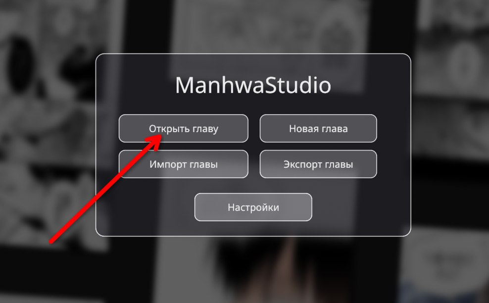
> Это кнопка открытия существующей главы. Там сейчас пусто, туда нам пока не надо, если ты конечно используешь программу впервые.

\
\
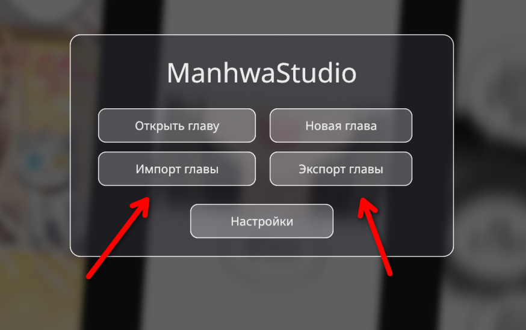
> Эти две кнопки вам тоже вряд-ли понадобятся. Они не относятся к экспорту в `png` чтобы залить на сайт. Это чтобы поделится **редактируемой** главой с кем-то в формате mschapter (по сути 7z архив)

\
\
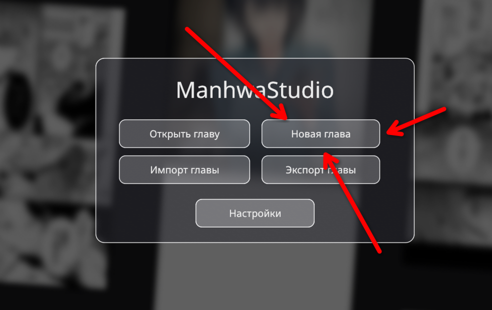
> ## **ВОТ** наша цель - **НОВАЯ ГЛАВА!!**


# Новая глава
> Откроется целое окно с кучей букав. **Рекомендую следовать простому режиму** и внимательно читать надписи.
> Можно скачать как английскую, так и корейскую/японскую/китайскую главу для перевода, программа умеет работать с азиатскими языками.
> Если тебя занесло на полную панель, не забудь, что сохранение в самом низу.
> В конце нажимай "Сохранить и открыть". Или потом в лаунчере нажми "Открыть главу".

## Где найти этот гайд в студии?
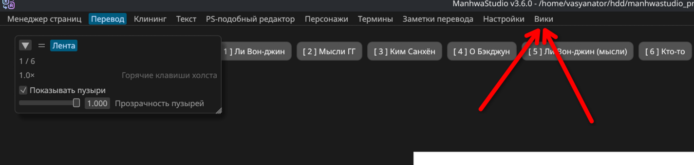
> Вверху вкладки, там вкладка **Вики**. Там найдёшь этот же гайд для чайников.


## Продвинутый выкачиватель: Глубокий перехват
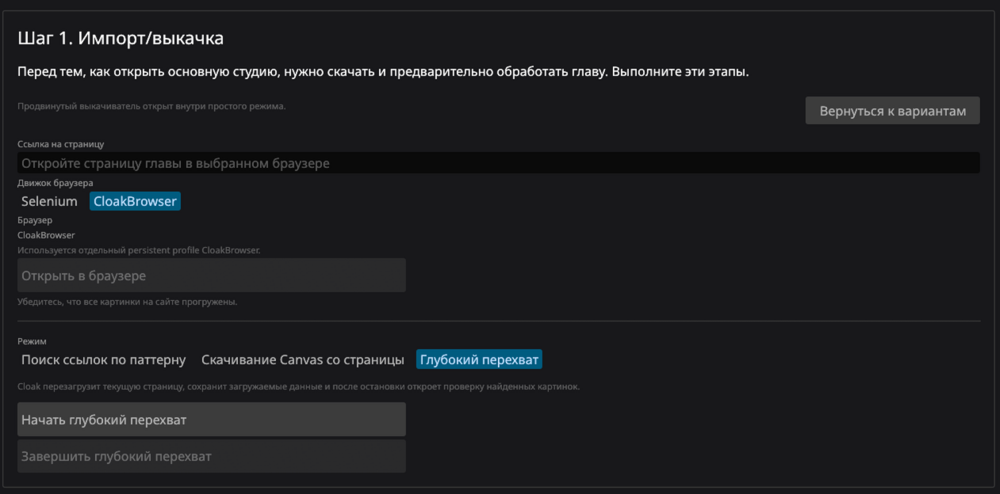
> Универсальный инструмент **глубокого проникновения** в недра открытого сайта для извлечения оттуда всего, что выглядит как картинка.

- Работает только с CloakBrowser
- Нужно вручную отбрасывать лишние картинки

> **Как какать?**
1. Вставляешь ссылку на какой-то сайт со сканлейтом, со всей силы давишь "Открыть в браузере"
2. Можешь пошарится по сайту: выбрать нужную главу, войти в аккаунт если глава доступна не всем
   * На Kakao Page достаточно просто создать акк, и можно брать по 1 платной главе в день, доступно на время
3. Жмёшь `Начать глубокий перехват`
4. Прокручиваешь страницу до конца, если это вертикальная лента. Или перелистываете все страницы, если манга.
5. Завершаешь глубокий перехват, ждёшь загрузки страниц

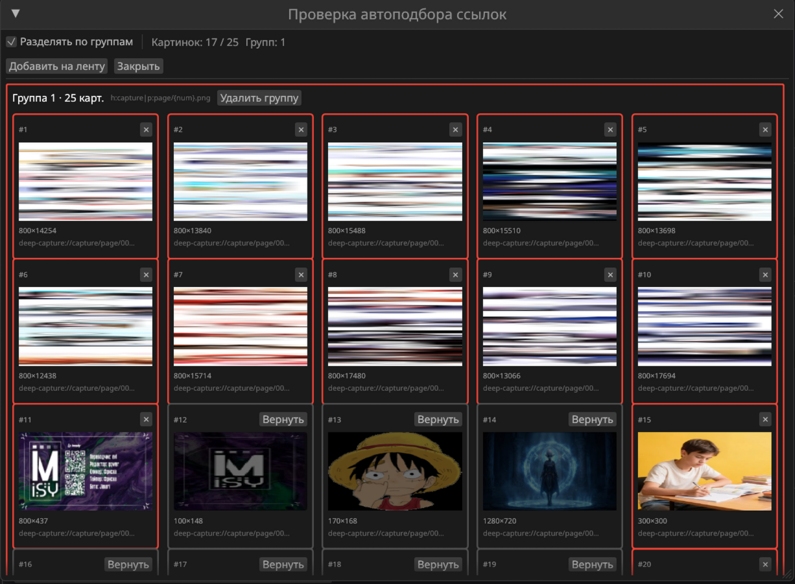

6. Появляется такое окно. В нём убираешь (нажав крестик) лишние картинки, которые явно не являются страницами
7. Добавляешь на ленту.
8. Панель в низ, и сохраняешь. Можно выбрать независимое сохранение и сохранить в любую папку. Но чтобы открыть студию, нужно сохранить как основу проекта.


---
---
---
# **Основная студия**: Как перевести скачанную главу?
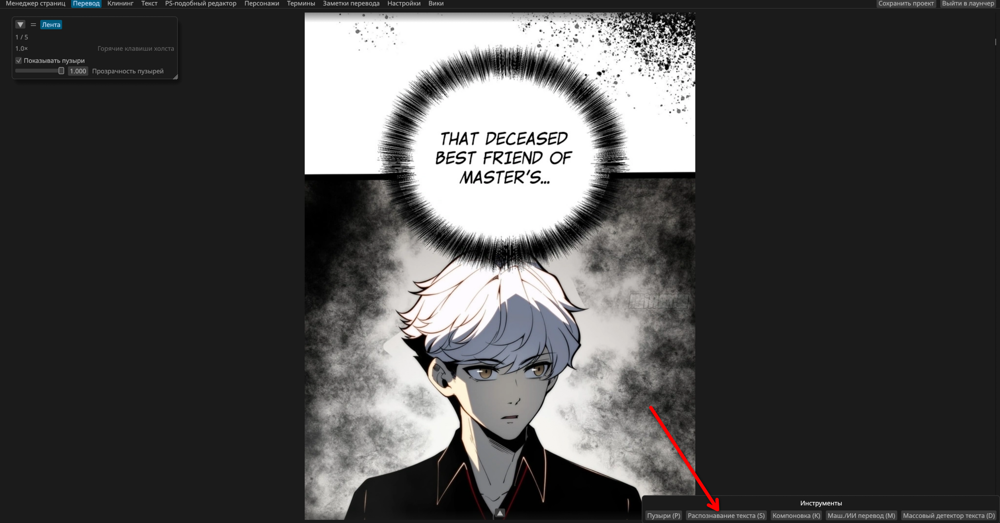

## Ты открыл главу. Первое что видишь - вкладка перевода.
Для начала, загрузи движок распознавания текста. Нажав на отмеченную стрелкой кнопку, появится панель.
`MangaOCR` для Японского, `PaddleOCR` для Китайского и Корейского, `EasyOCR` для Английского. `PaddleOCR-VL` и `Surya` подойдут для всего, но они заметно тяжелее.

Просто жмёшь "Загрузить движок", ждёшь пока он скачает ИИ модель (если в первый раз), после зелёного статуса панель можно закрыть.

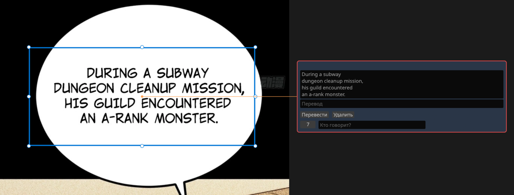

На `Shift+ЛКМ` выделяешь область с текстом, оно его распознаёт и появляется пузырь.

Если текст кривой, и движок его не распознаёт (например звук), просто сделай скриншот области, и отправь какому-то ИИ. Потом вставь распознанный в пустой пузырь, создаётся на `T`.

Рекомендую снизу пузыря указать персонажа. Будет очень полезно для дальнейшего перевода через ИИ.
> Можно конечно сделать массовый детект текста и потом всё распознать одной кнопкой, но персонажей это не расставит автоматически. А расставленные роли заметно улучшают качество перевода, когда скармливаешь текст ИИ.
> При создании нового пузыря, будет автоматически вставлена последняя роль. Можно вставить и более раннюю, используя клавиши 2-6, например `Shift+3+ЛКМ`

Рекомендую сначала так пройтись и распознать текст. Или хотя бы распознать 15-20 реплик перед компоновкой и отправкой в ИИ.

## Компоновка и перевод текста через ИИ

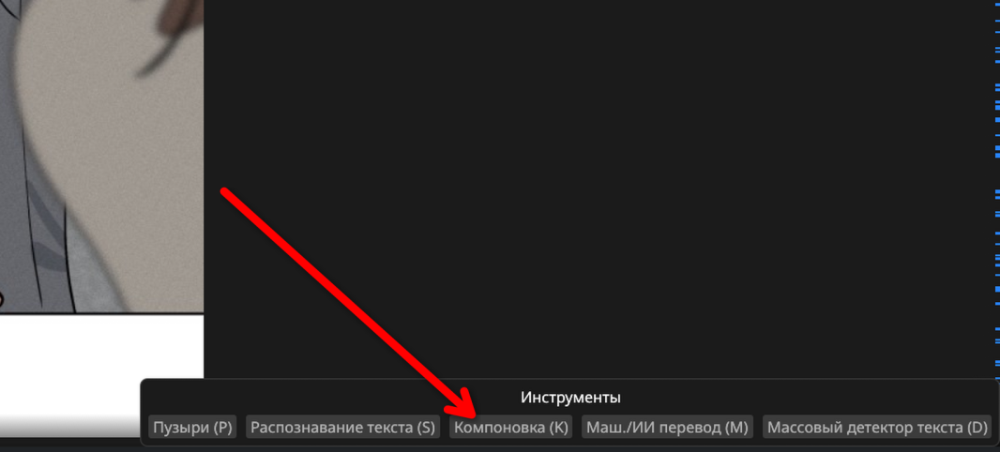
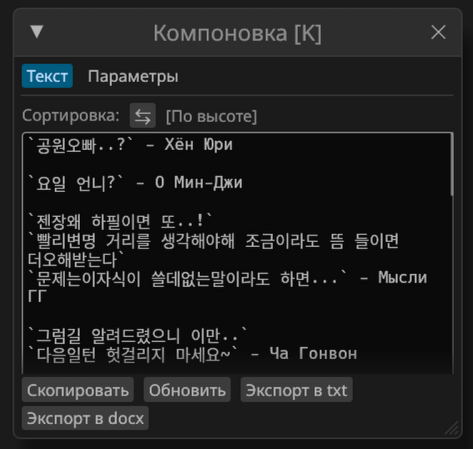

Эта кнопка открывает панель компоновки. Тут содержимое пузырей заботливо собирается в один текст. С лимитом и кучей настроек. По умолчанию выставлено то, что удобно для ИИ. Роли тоже добавляются. 

**Перед самим ИИ переводом, давай напишем системный промпт.**

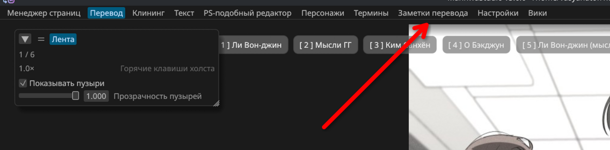

Делается он во вкладке `Заметки перевода`. Там перейди во вкладку `Шаблон` для редактирования.

Я со временем пришёл к такому промпту:

```text
Помоги пожалуйста с переводом вебтуна с корейского на русский.
# Правила перевода

- Я буду давать тебе распознанный текст, могут быть неточности от OCR, но чаще просто не хватает пробелов.
- Если я просто кидаю следующую партию реплик, значит всё нормально и продолжай в том же духе. Если есть проблемы, я поправлю.
- Внимательно обдумай варианты перевода, затем пиши финальный вариант, четко разделяя строки. 
  - В переводе пиши роли, но без кавычек и дополнительных описаний. Только переведённые строки
  - Реплика на новой строке - от того же персонажа, реплика через 2 новых строки - от другого персонажа. Персонаж подписан после его реплик.
  - Одна строка в `` - это одно облачко текста в комиксе, учитывай это и сохраняй структуру. Ни в коем случае не объединяй две реплики в одну, не придумывай новые, и старайся не делать слишком длинные реплики, если исходная была короткой.
  - Если я вставляю `(1)`, `(2)` и так далее после неопределенного говорящего, значит это вероятно два разных человека, но я не могу сказать, кто именно. Например, `кто-то из них (1)` и `кто-то из них (2)`. В таком случае сам расставь вероятные роли, опираясь на контекст и содержание реплик.
- После перевода, если есть новый термин или персонаж, записывай заметки о нём. В случае нового термина так же пиши оригинальное название.
- Старайся креативно адаптировать перевод под русскоязычную аудиторию, вставлять знакомый сленг и мемы, можешь менять интонацию и грубость реплик чтобы перевод был живее, но ни в коем случае не меняй смысл реплики кардинально.
  - Но будь аккуратен со всем этим. Например "Чё" вместо "Что" звучит нормально в реплике при общении с друзтями, но более взрослый персонаж так вряд-ли скажет вне подходящего контекста.
- Смешная отсебятина в мыслях главного героя приветствуется, именно тут и вставляй больше приколов. Можешь спокойно вставлять мат. Главное - не переборщить и не сделать трёхэтажный мат. Мысли обычного 20-летнего чела.
- Не вставляй в перевод суффиксы обращения по типу "–씨" (переводим как -си) лишний раз, если это не важно для понимания.

# **Контекст истории**

(тут должно быть описание вебтуна)

{charas}

{terms}
```

> Обрати внимание на `{charas}` и `{terms}`. Они будут заменены на список персонажей и терминов из соответствующих вкладок, которых ты добавишь позже. Нужно для стандартищации перевода имён, чтобы в разных главах не было например то `Бэ Хёнджон`, то `Пэ Хён-джон`

В общем, адаптируй этот промпт к своему тайтлу и вставь.

### **Какой ИИ выбрать?**

Я пробовал ChatGPT, Claude и Gemini.

- ChatGPT - консервативный, корпоративный и зажатый цензурой. Переводит точно, но неохотно адаптирует и не очень вставляет юмор. Подойдет для 12+ тайтлов.
- Claude - Тоже консервативный, но покреативнее GPT. У него бесплатная версия более ограниченная по использованию.
- Gemini - Самый интересный на мой взгляд. Достаточно щедные бесплатные лимиты, и сама модель довольно весёлая. Хорошо вставляет отсебятину и передаёт юмор, пусть перевод и не такой точный. Но он явно любитель дунуть травы, и сам нередко галлюцинирует, может переборщить с грубостью реплик.
- Grok - Лично я не пробовал, но судя по его характеру, один из немногих, кто согласится переводить хентай, но без жёстких тем.
- DeepSeek - Не пробовал, но думаю подходящий вариант для тех, кто в России. Только если тайтл не гонит на Великую Китайскую Партию

Можно попробовать и локальные модели, но это будет заметно более низкое качество.

### **Как какать (переводить)?**

1. Вставляешь промпт в чат, ждёшь ответ.
2. Включаешь побольше размышлений модели
3. Вставляешь первую партию текста из компоновки
4. Ждёшь ответ. Копируешь переведенные реплики одна за одной, вставляешь в пузыри **во вторую** (а не первую или третью) строку. При необходимости сам редактируешь. Почему вторую? Это строка **специально для перевода**. 
5. При необходимости, говоришь ИИ, что поправить. Вставляешь новые партии, пока глава не закончится.
6. Когда основные реплики переведены, можно перейти к звукам. Скринишь, кидаешь в ИИ, просишь предложить варианты перевода. Не всегда удачно, некоторые звуки можно оставить без перевода.

> Можно конечно вставить API ключ в машинный перевод, и это переведёт быстрее. Но когда сам вставляешь реплики одна за одной, намного лучше понимаешь происходящее, и удобнее поправить перевод.


### **Что делать со звуками?**

Движки распознавания текста зачастую плохо распознают кривой текст. Для начала, стоит научиться отличать звуки от реплик.

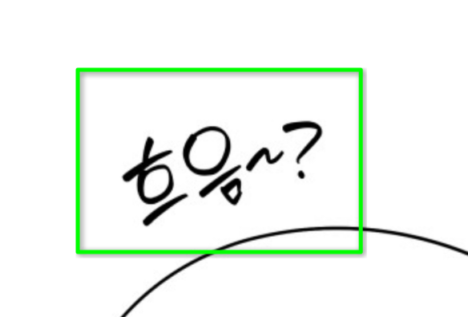
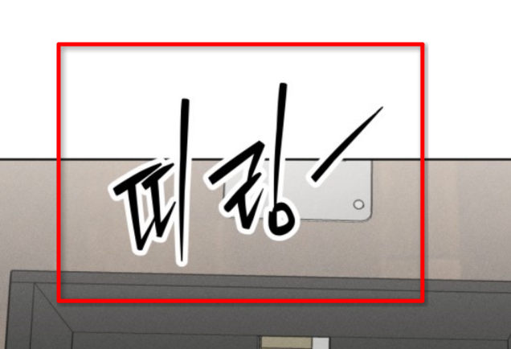
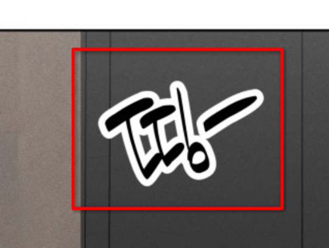
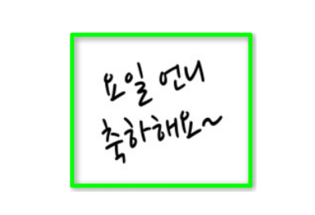

#### **На примере корейского вебтуна. Красным обведены звуки, зелёным - реплики.**
Если не уверен, где звук а где реплика, лучше спросить у ИИ.
На звуки можно забить болт, но даже мелкие реплики лучше переводить. Проще просто скинуть скриншот ИИ, он разберётся.


---

## **Клин**

Закончил перевод? Идём дальше. Теперь клин. Если не спик инглиш, то удаление оригинального текста.


### Чтобы ускорить клин, можно сначала найти текст. Просто открой `Массовый детектор текста`:
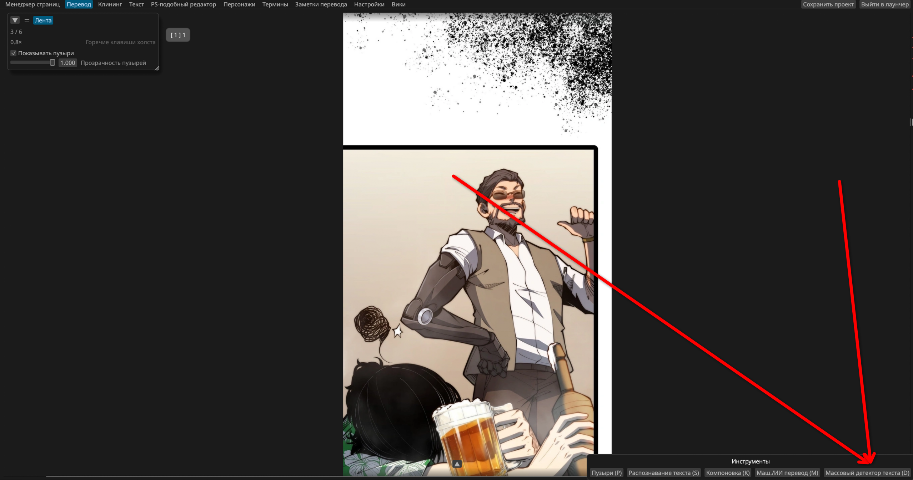

Наиболее универсальный тут - `ComicTextDetector`.
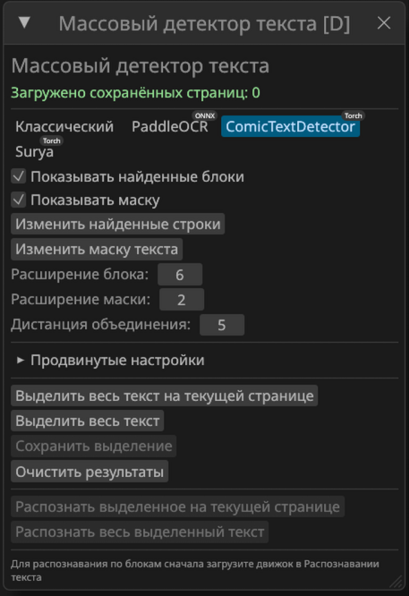

**Как какать?**
- Выбираешь `ComicTextDetector`
- Жмёшь `Выделить весь текст`. У тебя появляется красная обводка текста, и зелёные и синие блоки.
- Жмёшь `Сохранить выделение`
- ГАТОВО, про вкладку перевода можно забыть.

### Быстрый клин после детекта текста.

Уже всё, переходим во вкладку `Клин`.

Слева сверху видим 2 панели, на одной из них красуется кнопка `Быстрый клин найденного текста`:
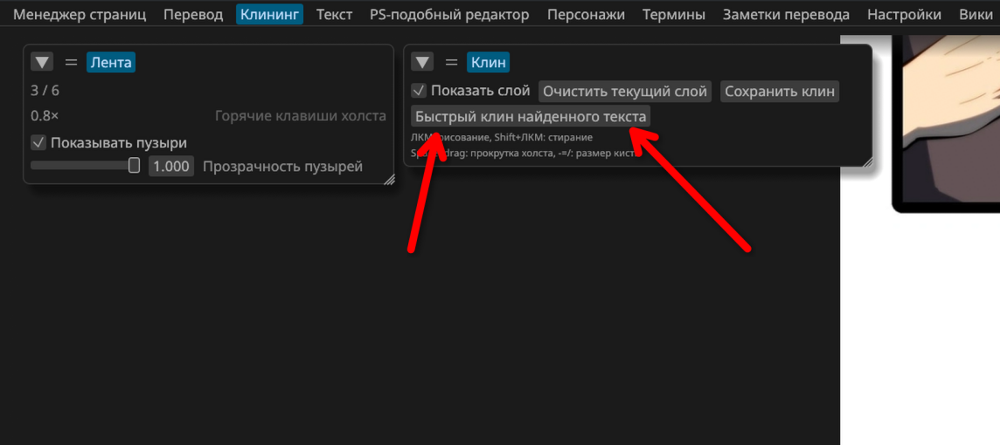

Жмякаем её. Видим новую панель:

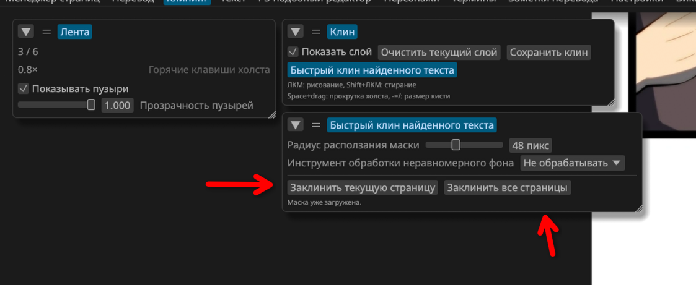

Тут можно ничего не менять. Просто жмёшь `Заклинить все страницы`. Чуть ждёшь, и результат обычно такой:


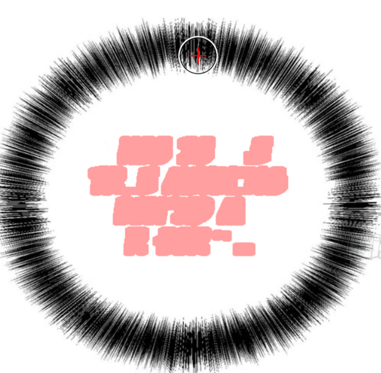

#### Поздравляю! Большая часть баблов очищена. Можно закрывать быстрый клин.

Но нередко очищается не весь текст, или бывает очищается неправильно:

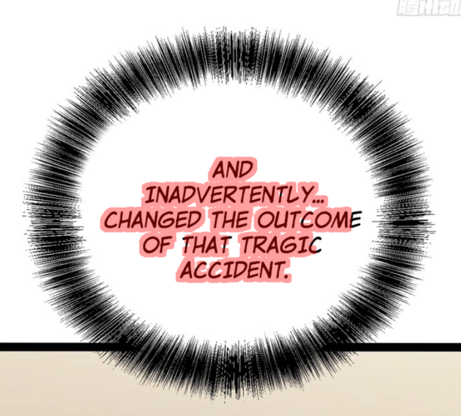
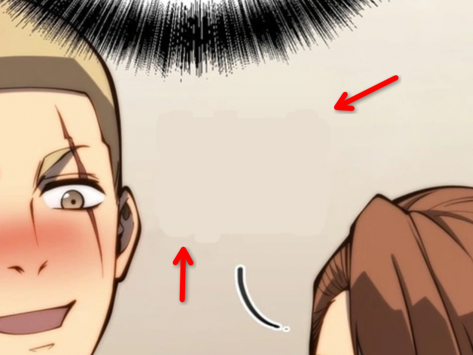

Такое нужно подправить руками. В качестве ластика и простой кисти для однородного фона берём инструмент `Замазка`. **Все комбинации клавиш написаны, если её выбрать.**
> Для картинок выше, в первом случае просто замазываем белым, во втором случае стираем на `Shift`. Как починить градиент, будет ниже.

### Неоднородный фон: Градиент

Инструмент так и называется, первый в категории `Удаление под маской`.

#### **Как юзать?**

- На `Shift+ЛКМ` выделяем область, где текст на фоне градиента
- В открывшемся окне закрашиваем текст жёлтой маской. **Важно, чтобы по краям маски был только градиент**.
- Мжём кнопку `Обработать`
- Если всё ок, нажимаем `Применить`
- ГАТОВО

Получится как-то так (до применения):

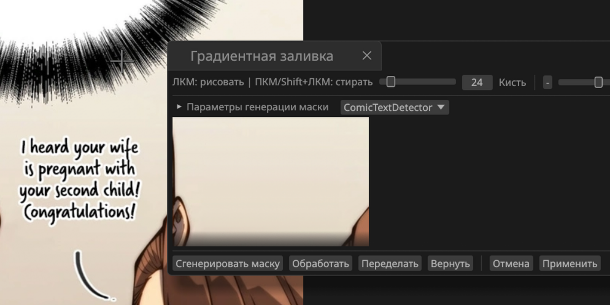

#### Почему именно градиент?
ИИ конечно тоже может его восстановить, но зачастую с косяками. Алгоритм это делает лучше. Встречается зачастую пару раз на главу, в манге - вообще редкость.


### Неоднородный фон: Lama
То же самое, что и градиент, но уже с ИИ, и восстанавливает текстуры и объекты.


### ИИ редактор области
Пока там только модель Flux.2 Klein. Клинит просто отлично, но качать надо 16-32 гб весов. И нужно минимум 12 гб видеопамяти, а лучше все 24. В общем для мажоров.

### Другие инструменты
На всё остальное можно не обращать внимание


### **В общем, удаляешь весь текст со страниц таким образом. Дальше - Тайп (размещение текста)**

---

## **Тайп**
**Вкладка называется `Текст`, переходим в неё.**

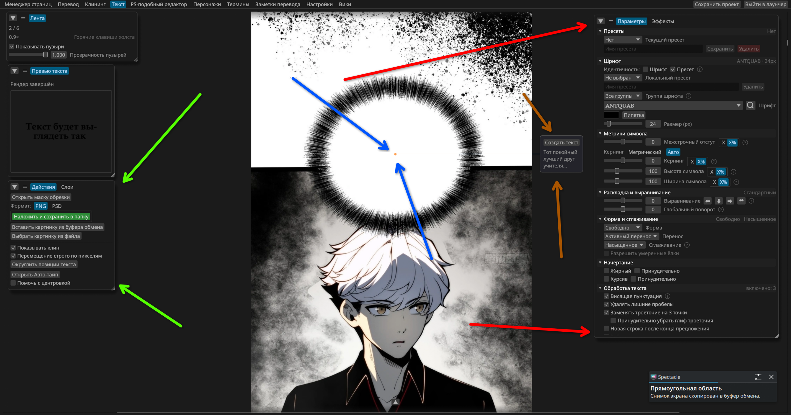

Вот что ты видишь. Не пугайся, щя всё объясню.

- **Красными стрелками** отмечена панель параметров текста. Там выбираешь, что и как будет выглядеть. За нужные параметры расскажу позже.
- **Коричневыми стрелками** отмечен пузырь перевода. Там текст, который недавно был переведён, если конечно всё сделано правильно.
- **Синими стрелками** отмечена **точка этого пузыря**. Она нужна для быстрой вставки текста после выделения (см ниже).
- **Зелёными стрелками** отмечена панель действий. Нужна, чтобы переключить видимость клина, и в конце **экспортировать главу в обычные картинки**.


### Как тайпить?
1. Выбираешь на панели подходящий шрифт
2. Делаешь выделение, зажимая `Shift+ЛКМ`
3. Отпускаешь, видишь примерно это:

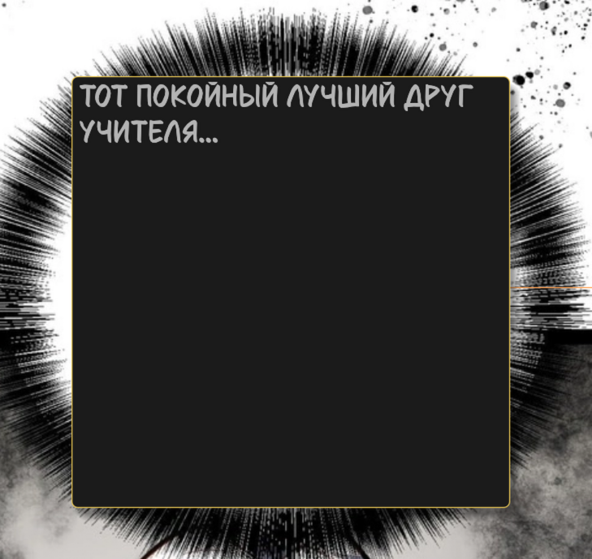

Это только приблизительный внешний вид следующего текста. Его можно менять в этом окне. Тыкни в любое место за пределами этого окна, чтобы сделать готовый текст.

4. Текст есть, и панель справа стала панелью его редактирования.

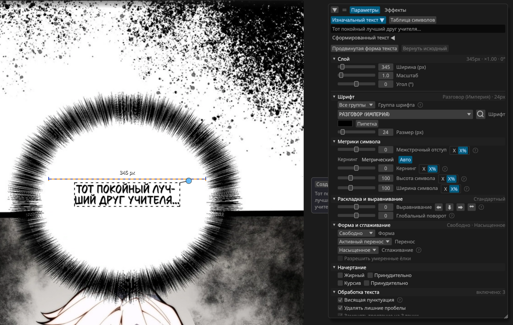

Панель редактирования слегка отличается, как минимум она имеет вверху поле текста и несколько слайдеров. Изменения на ней применятся ТОЛЬКО к выделенному тексту, и не повлияют на создание следующего.

5. Форма текста. Есть быстрая форма:

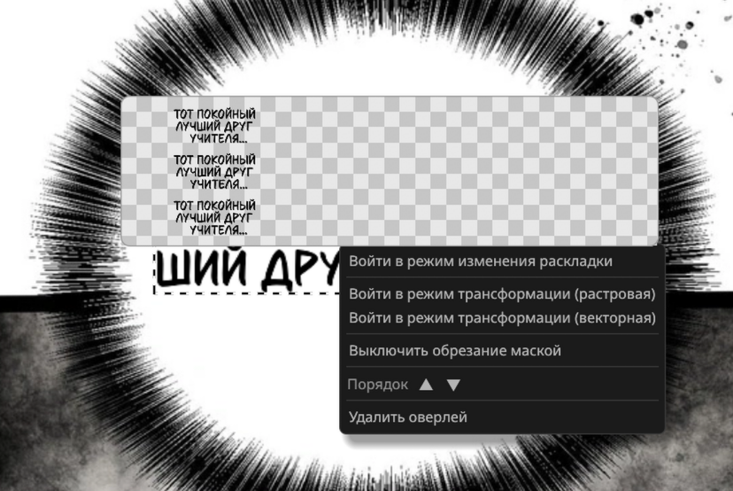

Меняется соответствующими параметрами на панели, или 9-ю вариантами в меню ПКМ. Она зависит от ширины текущего текста и размера шрифта, может меняться при их изменении.

А есть продвинутая форма текста:

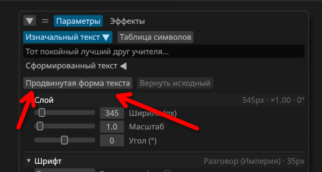
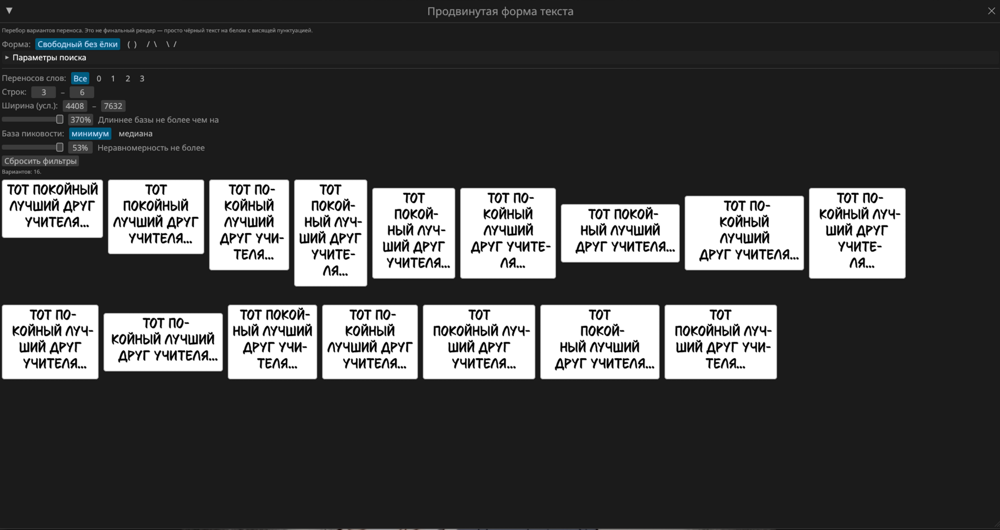

Это окно перебирает тысячи возможных вариантов с учётом текущего шрифта, и выдаёт самые оптимальные. Намерено избегает "Ёлок", без учёта висящей пунктуации. **Тут уже примененная форма не зависит от размера шрифта**, и всегда останется такой.

В общем, получается как-то так:
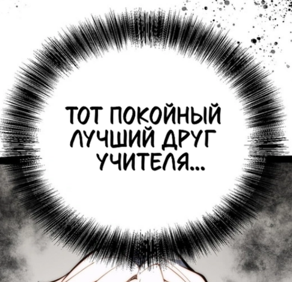

Дальше просто центруешь его, чтобы выглядело нормально. Можно использовать стрелочки для движения на 1 пиксель. Тыкаешь где-то для снятия фокуса. И идёшь к следующей реплике.


### Маска обрезки

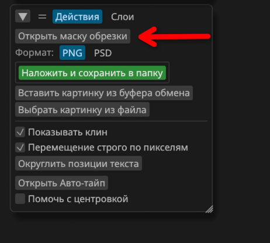
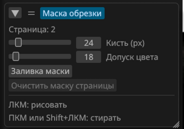

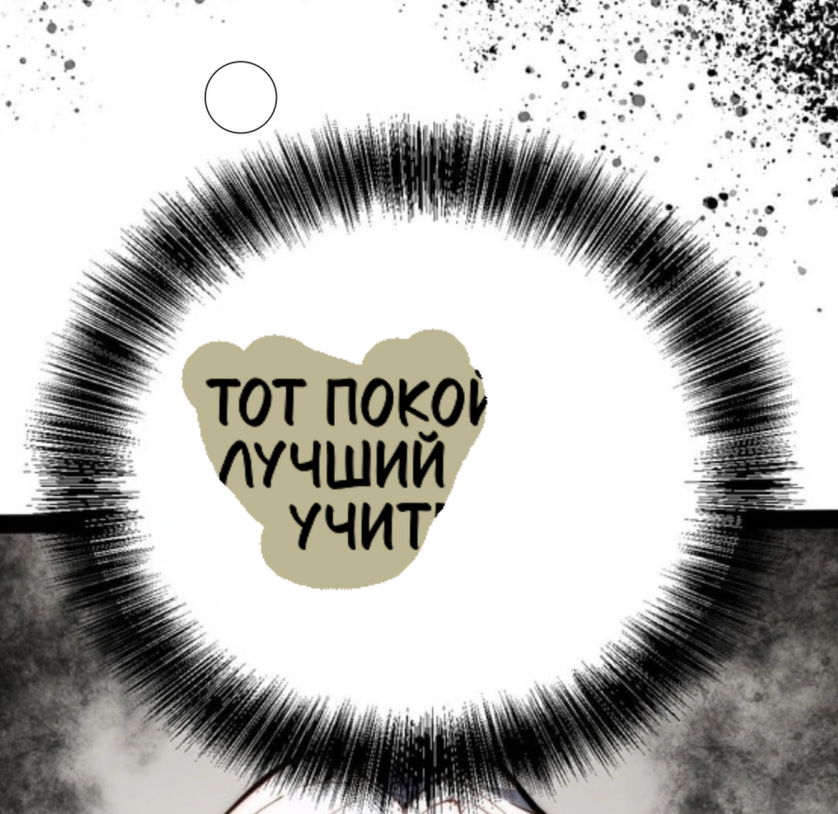

Если открыта, позволяет рисовать маску, вне которой текст не видно. Можно включить режим заливки и тыкнуть в бабл с достаточно чёткой границей, он сам зальётся маской.

Нужна, если надо где-то обрезать текст


### Помощь с центровкой

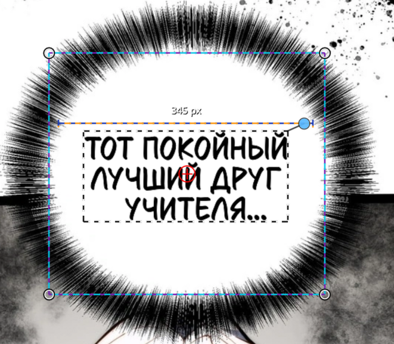

Переключается на панели действий или горячей клавишей `H`. Позволяет центровать не на глаз, а выставляя углы на края бабла.

### Эффекты

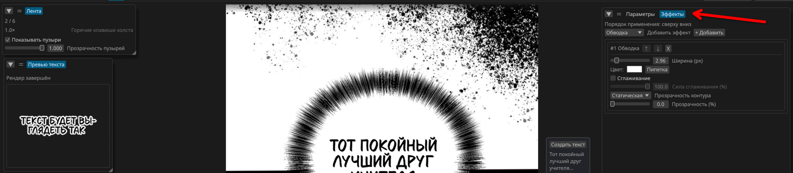

Вторая вкладка рядом с параметрами текста. Самые частые эффекты - обводка и градиент. Но там ещё много других.


#### **Есть ещё немало функционала, но вот весь базовый. Подробнее читай в соответствующей вкладке в Вики.**

В общем, таким образом делаешь главу.

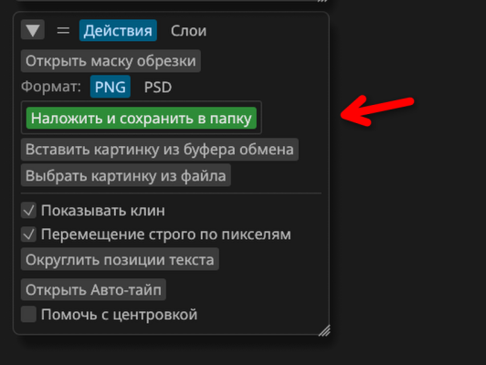

В конце выбираешь `Наложить и сохранить в папку`, и глава готова.


# **Гайд для чайников пройден!!!**