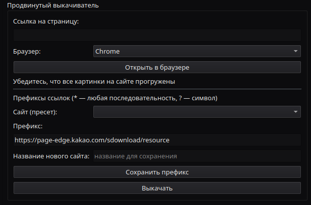

# Окно **Новый Проект**

Скачивает главу с разных сайтов и предварительно обрабатывает.

## **Импорт**
Кнопка `Открыть папку` позволяет открыть папку с картинками манхвы и импортировать их.

- Можно открыть папку с уже выкачанной главой, в таком случае картинки должны называться в правильном порядке, например `1.png/jpg/jpeg`
- Можно открыть сохраненный в основном браузере сайт с главой. 
  - В таком случае программа исследует лежащий на уровень выше `html` файл с названием папки, и загрузит картинки в том же порядке, в каком они были на странице.
  - Если HTML файл не найден, программа попытается загрузить картинки или `resource(X)` как картинки в порядке названия.
  - Можно задать паттерн названия файлов, если файлы картинок называются необычно
- Фильтр по +-50% ширины хорошо работает с комиксами вертикального формата, помогая убрать картинки рекламы, но его лучше отключить для манги и других страничных комиксов, иначе могут исчезнуть страницы

## **Быстрый выкачиватель**

- Строка для ввода вверху и кнопка выкачки позволяют быстро скачать бесплатную главу с comic.naver.com, **!Не с series.naver.com!**

## **Продвинутый выкачиватель**

Открывает указанную страницу в полноценном браузере и выкачивает картинки по паттерну ссылок, обходя запрет прямой загрузки.

- Работает по принципу `Если открывается в браузере, значит её выкачать`
- На странице текущей вкладки выкачивает все картинки по ссылкам с нужным паттерном
  - Есть готовые паттерны для mto.to, kakao, naver, funbe579
  - Если паттерна нет, можно просто написать свой. `*` означает любую комбинацию символов, `?` означает любой одиночный символ. Про реверс сайта ниже.
- Легко качает арендуемые главы с Kakao и теоретически платные с Naver
---
- `Браузер` - Узнает список доступных поддерживаемых браузеров. Это Google Chrome, Firefox, Edge и Safari (MacOS)
- `Открыть в браузере` - Запускает подконтрольный браузер и сразу открывает введенную выше ссылку.
- `Префиксы` - Паттерны для ссылок на картинки. Упрощенный синтаксис, который переводится в регулярные выражения.

## **Сшивание/Нарезка**

Сшивает все картинки в одну ленту, а потом разбивает их так, чтобы не резать по тексту и картинке. **!Не использовать для манги!**, только для манхвы/маньхуа и прочих комиксов в виде длинной ленты.

### **Параметры сшивания**
- `Количество частей`: На сколько частей разбивать ленту. Если пусто, то автоматически.
- `Hmax`: На части какой высоты (в пикселях) резать ленту при автоматическим разбитии.
- `Белая полоса`: Линию из скольких пикселей проверять на одноцветность при разметке мест резки. Если проще - насколько тонкой может быть полоска одного цвета, чтобы там можно было резать.
- `Допуск одноцветности`: Насколько сильно может отличатся цвет пикселей в месте, где можно резать. Стоит сделать побольше, если это сёдзё с кучей красивых картинок.
- `search radius`: Как далеко в обе стороны от намеченного места резки будет искаться подходящее место.

## **Нарезать как главу**

Берёт за основу выбранную главу, и режет картинки точно так же. Нужно, чтобы скачать альтернативные версии для инструмента Штамп.

Если есть разница в общей высоте обеих глав, то откроется окно:

Тут необходимо убедится, что картинки совпадают. Картинка скачанной главы будет полупрозрачной. Нужно отрегулировать высоту так, чтобы было как на первой картинке, а не как на второй.

### **После этого нужно сохранить как альтер-версию для выбранной главы, указав название.**

## **Waifu2x**

Прогоняет картинки через Waifu2x для устранения шума. Используется версия `nihui/waifu2x-ncnn-vulkan`. Рекомендуется использовать стандартные параметры.

## **Сохранение**

Сохраняет обработанный тайтл в структуру проекта или просто в папку.

- `Существующий тайтл` - сохранить выкачанную главу как главу существующего тайтла.
- `Новый тайтл` - Ввести название нового тайтла и создать ему первую главу.
- `Название главы` - как назвать главу

- `Сохранить и открыть` - сохранить скачанную главу в структуру проекта и открыть основную программу
- `Сохранить в папку` - сохранить скачанную главу в указанную папку и остаться в выкачивателе

# Взлом сайта и создание префикса
На примере mto.to

## 1. Открываем главу в обычном браузере и жмём F12

## 2. Наводимся на разные HTML теги и браузер сам показывает, за что они отвечают. Если выделена часть сайта с картинкой главы - открываем тег, пока не дойдем до самой картинки.

## 3. Открываем тег с конкретной картинкой и смотрим, какая там ссылка.

### Например, тут у нас ссылка `https://n27.mbeaj.org/media/mbch/a97/6921b1dc4b5d85970424179a/128472992_800_14755_1072554.webp` Открываем её в новой вкладке и убеждаемся, что это картинка.

### Далее, открываем ещё несколько тегов с картинками и собираем ссылки. Например, вот:
- `https://n27.mbeaj.org/media/mbch/a97/6921b1dc4b5d85970424179a/128472992_800_14755_1072554.webp`
- `https://n25.mbuul.org/media/mbch/a97/6921b1dc4b5d85970424179a/128472994_800_12860_1448870.webp`
- `https://n21.mbrtz.org/media/mbch/a97/6921b1dc4b5d85970424179a/128473001_800_15000_1578696.webp`
- `https://n06.mbwww.org/media/mbch/a97/6921b1dc4b5d85970424179a/128473003_800_15000_1167770.webp`

## 4. Внимательно смотрим на ссылки, и ищем общее. Например вот:
- Например, субдомен всегда начинается с n
- В названии сайтов всегоа есть mb
- Первый раздел всегда /media
- Остальное, например `mbch/a97/6921b1dc4b5d85970424179a`, может меняться от тайтла к тайтлу

## 5. Вспоминаем, как работает мой упрощенный шаблон
- `*` означает любую комбинацию символов
- `?` означает любой одиночный символ

## 6. Составляем префикс-шаблон
- Берем начало ссылки, в данном случае `https://n06.mbwww.org/media/`
- Заменяем всё меняющееся на символы подстановки, например вместо `n06` будет `n*` или `n??`
- Добавляем в конец *
- Получается что-то такое: `https://n*.mb*.org/media/*`

## 7. Поздравляю! `https://n*.mb*.org/media/*` можно вставлять как префикс в продвинутый выкачиватель